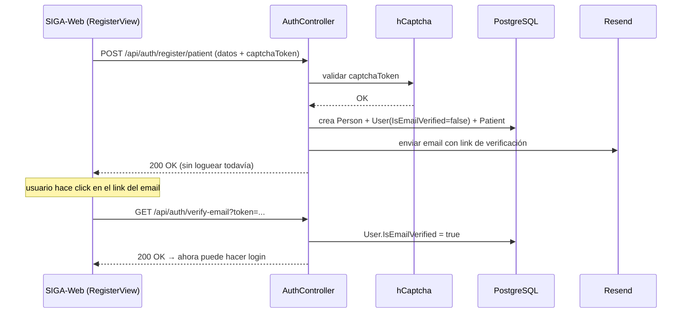
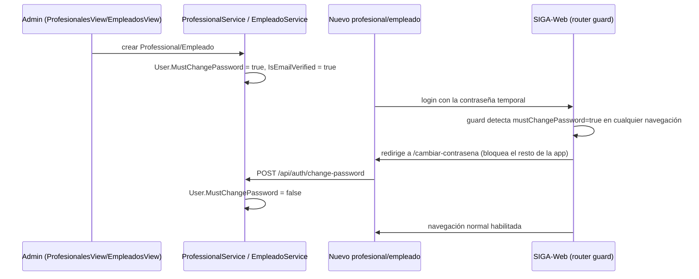

# Módulo: Identidad y Acceso

## Propósito

Gestiona quién puede entrar a SIGA y con qué credenciales: autenticación (login JWT), ciclo de vida de la cuenta (`User`) y los flujos de contraseña (self-service, reset por admin, cambio obligatorio en primer login, recuperación por email). Es la base sobre la que se apoyan todos los demás módulos — sin `User` autenticado no hay acceso a ningún endpoint protegido. El ABM del catálogo de `Role`/`Permission` en sí (qué permisos tiene cada rol) se documenta aparte en [`12-roles-y-permisos.md`](./12-roles-y-permisos.md); acá el foco es la cuenta y su acceso.

## Entidades principales

| Entidad | Rol |
|---|---|
| `Person` | Datos personales de cualquier individuo del sistema — ver [`schema.md` Grupo A](../schema.md#grupo-a--identidad-personas-y-personal) |
| `User` | Cuenta de acceso, 1:1 con `Person`. `SucursalId` nullable, `PasswordHash`, `IsActive`, `IsEmailVerified`, `MustChangePassword`, `PasswordResetToken` |
| `Role` / `UserRole` | Roles asignados al usuario (many-to-many) — detalle en `12-roles-y-permisos.md` |

## Reglas de negocio clave

- **Login es email + contraseña, resuelto vía `Person.Email`** (join `User`→`Person`), no hay username separado.
- **JWT lleva permisos, no roles** — el token emite un claim `"permission"` por cada permiso resuelto de los roles del usuario, más `professional_id` (si aplica) y `sucursal_id` (si el usuario tiene sucursal fija). Ver [ADR 0003](../adr/0003-autorizacion-por-permisos.md) y [`architecture.md` § Autorización](../architecture.md#autorización-permisos-no-roles).
- **Auto-registro de pacientes es el único flujo de alta pública** (`POST /api/auth/register/patient`): protegido con hCaptcha, crea `Person`+`User`+`Patient` con `IsEmailVerified=false` y exige verificar el email (`GET /api/auth/verify-email?token=`) antes de poder loguear. El alta de `Professional`/`Empleado` (por un admin) **no** pasa por este flujo — ver más abajo.
- **`IsEmailVerified=true` bloquea el login si es `false`** — pero solo aplica de verdad al auto-registro público. `ProfessionalService.CreateAsync`/`EmpleadoService.CrearAsync` setean `IsEmailVerified=true` directamente al crear la cuenta (son altas "vouched-for" por un admin, no necesitan verificar email). Esto corrigió un bug real: antes de esa corrección, ningún profesional/empleado creado por ABM podía loguear nunca (quedaban con `IsEmailVerified=false` sin que nadie disparara el email de verificación).
- **`MustChangePassword` solo aplica a cuentas nuevas, no retroactivo.** Se setea `true` al crear un `Professional`/`Empleado`; no bloquea el login (a diferencia de `IsEmailVerified`) — el frontend redirige *después* de autenticar, vía guard de router que cubre navegación directa y refresh, no solo el submit del login. Ver [ADR 0012](../adr/0012-cambio-contrasena-solo-cuentas-nuevas.md).
- **Tres formas de cambiar contraseña, cada una con su propio permiso/regla:** self-service (`POST /api/auth/change-password`, pide la actual), admin-reset (`PUT /api/users/{id}/reset-password`, policy `editar_usuario`, no pide la actual, fuerza `MustChangePassword=true`), y recuperación por email sin sesión (`forgot-password`/`reset-password`, `AllowAnonymous`, con token). **Nota:** la memoria de proyecto de la sesión que implementó self-service/admin-reset (2026-07-03) registraba la recuperación por email como "fuera de alcance, no construida" — pero el código actual (`AuthController`) sí tiene `forgot-password`/`reset-password` implementados. Es una adición posterior no reflejada en esa memoria; confirmar con el usuario si hace falta actualizarla.
- **Sin invalidación de JWTs emitidos** al cambiar o resetear una contraseña — limitación de seguridad conocida, no hay infraestructura de revocación/blacklist.
- **Borrado lógico vía `User.IsActive=false`**, no hay borrado físico de cuentas.

## Endpoints

Detalle completo (policies, DTOs) en [`api-reference.md` § 1](../api-reference.md#1-identidad-y-acceso).

| Método | Ruta | Descripción |
|---|---|---|
| POST | /api/auth/register/patient | Auto-registro público de paciente (hCaptcha + verificación de email) |
| GET | /api/auth/verify-email | Confirma el email desde el link enviado |
| POST | /api/auth/login | Login, devuelve JWT + claims |
| POST | /api/auth/change-password | Self-service, requiere contraseña actual |
| POST | /api/auth/forgot-password / reset-password | Recuperación sin sesión, por token de email |
| GET / DELETE | /api/users | Listado y desactivación de cuentas |
| PUT | /api/users/{id}/reset-password | Reset por admin, sin pedir la actual |

## Flujo típico

### Auto-registro de paciente + verificación de email

### Cambio de contraseña obligatorio (cuenta nueva de staff)

## Vistas de frontend

- `LoginView.vue`, `RegisterView.vue`, `VerifyEmailView.vue`
- `OlvideContrasenaView.vue`, `RestablecerContrasenaView.vue` (recuperación por email)
- `CambiarContrasenaObligatoriaView.vue` (pantalla aislada, forzada por router guard)
- `UsuariosView.vue` (listado, roles por usuario, activar/desactivar, "Restablecer contraseña" en el modal de gestión — **nota UX conocida:** ese modal se abría encima de "Gestionar Roles" sin cerrarlo, corregido)
- Modal "Cambiar contraseña" en `AppHeader.vue` (self-service, no es una vista propia)

## Estado

✅ Implementado y verificado end-to-end (self-service, admin-reset, cambio obligatorio) contra la base de dev con Playwright el 2026-07-03. La recuperación por email (`forgot-password`/`reset-password`) está presente en el código pero no tiene el mismo nivel de verificación registrado en memoria — confirmar antes de darla por probada en producción.

⚠️ Limitaciones conocidas: sin invalidación de JWTs emitidos, sin reglas de complejidad de contraseña más allá de longitud mínima (6 caracteres según memoria de proyecto — confirmar contra `AuthService` si se necesita el valor exacto para la tesis).
