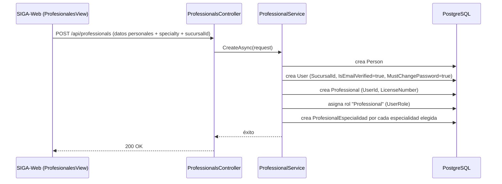

# Módulo: Pacientes y Profesionales

## Propósito

Administra las dos bases de personas que participan directamente de la atención clínica: los pacientes de la óptica y los profesionales de salud (optómetras/oftalmólogos) que los atienden. Ambos parten de `Person`, pero con reglas de acceso opuestas: el paciente puede existir sin cuenta, el profesional siempre la necesita.

## Entidades principales

Ver [`schema.md` Grupo A](../schema.md#grupo-a--identidad-personas-y-personal) para el diagrama completo.

| Entidad | Rol |
|---|---|
| `Patient` | Marca que una `Person` es paciente. `UserId` **nullable** — puede existir sin acceso al sistema |
| `Professional` | Marca que una `Person` es profesional de salud. `UserId` **obligatorio** (1:1) |
| `Especialidad` / `ProfesionalEspecialidad` | Catálogo de especialidades, many-to-many con `Professional` |
| `HorarioProfesional` / `PausaHorario` / `BloqueoFecha` | Disponibilidad del profesional — consumida por el módulo Agenda, se gestiona desde acá (form de Profesional) |

## Reglas de negocio clave

- **Paciente sin cuenta es el caso normal, no la excepción:** recepción da de alta un paciente con solo CI/nombre/contacto (`Patient.UserId = null`). Solo si el paciente necesita el portal de autogestión (ver sus turnos/recetas/historial) se crea un `User` vinculado — vía el flujo de auto-registro público, no desde el ABM interno de pacientes. Ver [`01-identidad-y-acceso.md`](./01-identidad-y-acceso.md).
- **Profesional siempre requiere `User`** — no existe un "profesional sin login". El alta de un profesional crea `Person`+`User`+`Professional` en una sola operación transaccional, con `IsEmailVerified=true` e `IsUserMustChangePassword=true` (cuenta vouched-for por el admin, no auto-registro).
- **La sucursal del profesional se asigna en este formulario, no en `UsuariosView`** — es una decisión explícita del rediseño multi-sucursal (2026-06-28): `User.SucursalId` se sigue guardando en `User`, pero la UX de asignación vive en `ProfesionalesView`/`EmpleadosView`, no en la pantalla de usuarios (que solo gestiona roles y activar/desactivar). Ver [`project_sucursales`, memoria de proyecto].
- **Un profesional puede tener más de una especialidad** (many-to-many vía `ProfesionalEspecialidad`), a diferencia de un diseño más simple de "una especialidad por profesional".
- **Disponibilidad del profesional es multi-capa:** `HorarioProfesional` (horario semanal recurrente, por sucursal — índice único `ProfessionalId+SucursalId+DiaSemana`), `PausaHorario` (recesos dentro de un horario, ej. almuerzo) y `BloqueoFecha` (excepciones puntuales, ej. vacaciones). Los tres alimentan el cálculo de slots disponibles del módulo Agenda, pero se gestionan desde el form de Profesional.
- **Borrado lógico** (`Patient.IsActive` / desactivación de `User` para `Professional`) — sin borrado físico.

## Endpoints

Detalle completo en [`api-reference.md` § 2](../api-reference.md#2-personas) (`PatientsController`, `ProfessionalsController`, `EspecialidadesController`) y [§ 4](../api-reference.md#4-agenda) (`HorariosController`, anidado bajo `/api/professionals/{id}`).

| Método | Ruta | Descripción |
|---|---|---|
| GET/POST/PUT/DELETE | /api/patients | CRUD + desactivación de pacientes |
| GET/POST/PUT/DELETE | /api/professionals | CRUD + desactivación de profesionales |
| GET/POST/PUT/DELETE | /api/especialidades | Catálogo de especialidades |
| GET/PUT | /api/professionals/{id}/horarios | Horario semanal (reemplaza el set completo por sucursal) |
| GET/POST/DELETE | /api/professionals/{id}/bloqueos | Fechas bloqueadas |

## Flujo típico

### Alta de profesional (transacción multi-entidad)

### Alta de paciente sin cuenta (caso normal)

Recepción completa un formulario simple (CI/nombre/contacto) → `POST /api/patients` crea `Person`+`Patient` sin `User`. El paciente queda disponible de inmediato para agendar turnos, tener historia clínica y figurar en ventas — no hace falta que tenga acceso al portal.

## Vistas de frontend

- `PacientesView.vue`, `PacienteNuevoView.vue`, `PacienteDetailView.vue`
- `ProfesionalesView.vue` (incluye asignación de sucursal, horarios y especialidades)
- `EspecialidadesView.vue`
- Portal del paciente (autogestión, requiere `Patient.UserId` no nulo): `MiHistorialView.vue`, `MisRecetasView.vue` — documentadas en detalle en [`05-clinica.md`](./05-clinica.md), ya que son vistas de historial clínico, no de datos personales.

## Estado

✅ Implementado. Sin limitaciones conocidas relevantes para la tesis más allá de las ya anotadas en `api-reference.md` (ej. `DELETE /api/professionals/{id}` usa la policy `editar_profesional` en vez de una policy de desactivación dedicada, a diferencia de `Patient`/`Cliente`).
