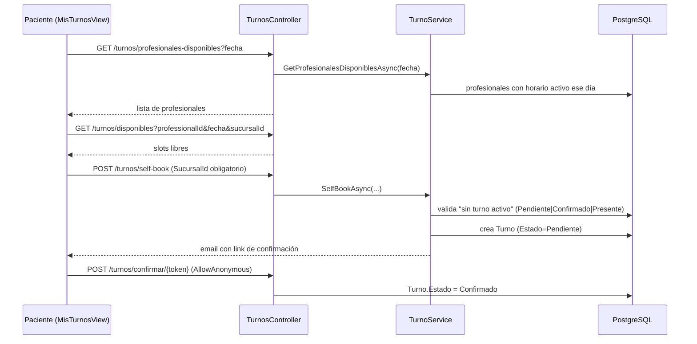

# Módulo: Agenda / Turnos

## Propósito

Gestiona el calendario de turnos entre pacientes y profesionales: reserva por parte de recepción/staff, auto-reserva del propio paciente desde el portal (self-booking), disponibilidad del profesional (horarios semanales, pausas, bloqueos puntuales) y el ciclo de confirmación/cancelación de un turno. Es la puerta de entrada habitual a una `ConsultaClinica`, aunque el vínculo entre ambas sigue siendo débil (ver nota de deuda técnica más abajo).

## Entidades principales

| Entidad | Rol |
|---|---|
| `Turno` | El turno en sí: paciente, profesional, sucursal, fecha/hora, estado. Ver `../schema.md` Grupo B. |
| `HorarioProfesional` | Disponibilidad semanal recurrente de un profesional, por sucursal. Ver `../schema.md` Grupo A. |
| `PausaHorario` | Ventana de pausa dentro de un `HorarioProfesional` (ej. almuerzo). Ver `../schema.md` Grupo A. |
| `BloqueoFecha` | Excepción puntual a la disponibilidad (ej. vacaciones, feriado). Ver `../schema.md` Grupo A. |
| `EstadoConfig` | Estado cosmético configurable (color/nombre) para `Turno.EstadoCustomId`, no gobierna la lógica. Ver `../schema.md` Grupo B. |

## Reglas de negocio clave

- **`Turno.Estado` (enum `TurnoEstado`) es la fuente de verdad de la lógica**; `EstadoCustomId` (FK a `EstadoConfig`) es puramente cosmético/configurable por el negocio (color, nombre visible) y no la reemplaza — ver `../schema.md` Grupo B.
- **Un paciente solo puede tener un turno activo a la vez.** "Activo" = `Pendiente | Confirmado | Presente`. Un turno `Completado` no cuenta como activo (fix explícito: antes bloqueaba con cualquier estado no-cancelado, incluido `Completado`, dejando al paciente sin poder reservar nunca más tras su primera consulta).
- **Self-booking exige `SucursalId` obligatorio** en `SelfBookTurnoRequest` — impacto directo del proyecto multi-sucursal, ver [ADR 0009 — Sucursal fija por usuario](../adr/0009-sucursal-fija-por-usuario.md). El paciente, al ser global (sin sucursal propia), elige la sucursal en el momento de reservar.
- **`HorarioProfesional` está scopeado por sucursal**, con índice único `ProfessionalId + SucursalId + DiaSemana` — un mismo profesional puede tener horarios distintos en cada sucursal donde atiende.
- **Policy `ver_disponibles` es un OR** (`ver_agenda` del staff **o** `ver_mis_turnos` del paciente) — permite que ambos perfiles consulten slots libres sin exponerle al paciente el resto de la agenda.
- **Confirmación por token de email:** `POST /api/turnos/confirmar/{token}` es público (`AllowAnonymous`) — el paciente confirma el turno desde el link del email sin necesidad de estar logueado.
- **Cancelación en dos pasos:** el paciente solo puede *solicitar* la cancelación (`solicitar-cancelacion`, marca `Turno.SolicitudCancelacion = true`); el staff es quien la resuelve (`gestionar-cancelacion`, aprueba o rechaza). El paciente nunca cancela directamente su propio turno.
- **Recordatorios automáticos:** `TurnoReminderService` (`BackgroundService`, ver `../architecture.md` § Trabajos en segundo plano) envía recordatorios por email antes del turno.

## Endpoints

| Método | Ruta | Descripción |
|---|---|---|
| GET | `/api/turnos` | Listado filtrado (staff) |
| GET | `/api/turnos/disponibles` | Slots libres (staff u paciente, policy OR) |
| GET | `/api/turnos/profesionales-disponibles` | Profesionales con horario activo ese día (paso 1 del self-booking) |
| POST | `/api/turnos` | Alta manual (staff) |
| PUT | `/api/turnos/{id}/estado` | Cambio de estado |
| GET / POST | `/api/turnos/mis-turnos` · `/api/turnos/self-book` | Portal del paciente |
| POST | `/api/turnos/{id}/solicitar-cancelacion` · `/gestionar-cancelacion` | Cancelación en dos pasos |
| POST | `/api/turnos/confirmar/{token}` | Confirmación pública por email |
| GET/PUT | `/api/professionals/{id}/horarios`, `/bloqueos` | Disponibilidad del profesional (`HorariosController`) |

Detalle completo (policies, DTOs) en [`../api-reference.md`](../api-reference.md) § 4. Agenda.

## Flujo típico

Self-booking desde el portal del paciente:

Cancelación: el paciente solicita (`solicitar-cancelacion`) → el staff ve la bandera `SolicitudCancelacion` en `AgendaView` → aprueba o rechaza (`gestionar-cancelacion`).

## Vistas de frontend

- `AgendaView.vue` — agenda del staff.
- `MisTurnosView.vue` — portal del paciente: calendario mensual propio (grilla 7×6, sin librería externa), modal de reserva en dos pasos (profesional → horario), respeta la regla de "un solo turno activo".
- `ConfirmarTurnoView.vue` — landing pública del link de confirmación por email.
- La gestión de horarios/pausas/bloqueos del profesional no tiene vista propia — vive embebida en `ProfesionalesView.vue` (confirmar al detalle si se profundiza este módulo más adelante).

## Estado

✅ Implementado, incluyendo self-booking, confirmación por email y scoping multi-sucursal (Fase 4 del proyecto de sucursales).

⚠️ **Deuda técnica heredada:** `ConsultaClinica.CitaId` sigue siendo un `int?` **sin FK** a `Turno` (se dejó así originalmente porque Agenda no existía todavía). Agenda ya está implementada hace tiempo, pero el vínculo formal entre un turno completado y la consulta que genera nunca se agregó — ver nota en `../schema.md` Grupo B.

⚠️ Vistas de horarios: la memoria de proyecto no documenta un `HorariosProfesionalView.vue` dedicado; si este módulo se profundiza, confirmar en qué componente exacto vive el formulario de horarios dentro de `ProfesionalesView.vue`.