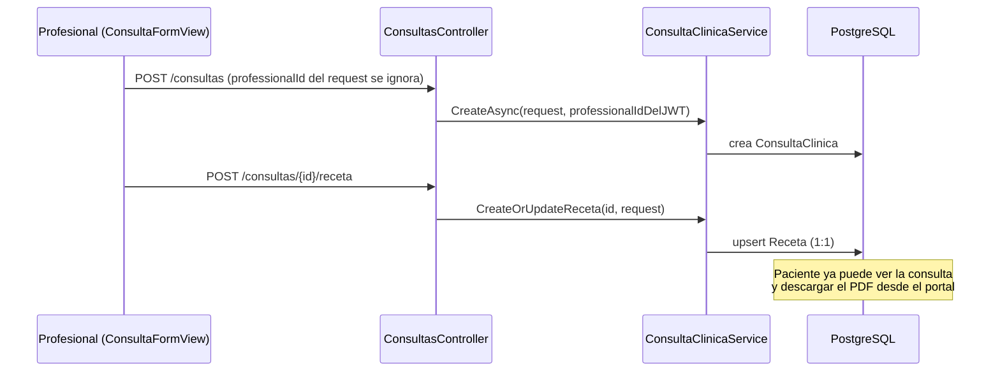

# Módulo: Clínica

## Propósito

Registra la historia clínica de cada paciente (consultas) y la receta óptica resultante, con generación de PDF y acceso propio del paciente a su historial y recetas desde el portal. Una receta puede nacer de una consulta o cargarse manualmente sin consulta previa ("externa"), para cubrir el caso de un cliente que trae una receta de otra óptica.

## Entidades principales

| Entidad | Rol |
|---|---|
| `ConsultaClinica` | Cabecera de la consulta: paciente, profesional, sucursal, motivo, diagnóstico. Ver `../schema.md` Grupo B. |
| `Receta` | Graduación óptica (OD/OI: esférico, cilindro, eje, adición), 1:1 opcional con una consulta **o** vinculada directo a una `Person` (externa). Ver `../schema.md` Grupo B. |

## Reglas de negocio clave

- **El profesional se autoasigna desde el JWT** (claim `professional_id`), nunca se selecciona en el formulario: al crear/editar una consulta, si quien llama es un profesional, el backend sobrescribe `ProfessionalId` con el propio, ignorando lo que venga en el request. El listado (`GET /api/consultas`) también se auto-filtra a las consultas del profesional autenticado.
- **Receta clínica o externa** — ver [ADR 0008](../adr/0008-receta-clinica-o-externa.md): una `Receta` puede colgar de una `ConsultaClinica` (1:1, `Cascade`) o cargarse manual para una `Person` sin consulta (`PersonId`, sin `ConsultaClinicaId`). El flujo de venta a pedido consume ambas por igual vía `GET /api/recetas?clienteId=`.
- **`ConsultaClinica.CitaId` sigue sin FK real** — deuda técnica heredada de cuando Agenda no existía todavía; sigue así aunque `Turno` ya está implementado. Ver `04-agenda-turnos.md` § Estado y `../schema.md` Grupo B.
- **El estado de una consulta NO es un enum C#, a diferencia de `Turno`.** `ConsultaClinica` no tiene columna `Estado`: su único campo de estado es `EstadoConfigId` (FK a `EstadoConfig`, la misma tabla de configuración que en `Turno` es puramente cosmética — ver `04-agenda-turnos.md`). Para Consulta, en cambio, `EstadoConfig` **sí es funcional**: `ConsultaClinicaService.CreateAsync` busca la fila con `Entidad == "Consulta" && CodigoInterno == "Abierta"` para asignar el estado inicial. Los 4 estados reales (verificados en `DbSeeder.EstadosIniciales`, verificado 2026-07-09) son **Pendiente, Abierta, Cerrada, Cancelada** — coincide con lo que describe `manual-usuario.md`. A diferencia de los estados de `Turno`/`Pedido` (`EsProtegido = true`), los 4 estados de Consulta se siembran con **`EsProtegido = false`** — un detalle a tener en cuenta, ver nota de riesgo en "Estado" más abajo.
- **PDF de receta** (`QuestPDF`, A5, 1.5cm de margen): `GET /api/consultas/{id}/receta/pdf` devuelve 404 si la consulta no tiene receta cargada. El paciente tiene su propio endpoint equivalente (`/mi-receta/pdf`) que valida que la consulta le pertenezca antes de generar el archivo.
- **Portal del paciente de solo lectura:** `mis-consultas` y `mi-receta/pdf` resuelven el `patientId` a partir del `userId` del JWT (el JWT no trae `patient_id` directo), replicando el mismo patrón de resolución que usa `TurnoService`.

## Endpoints

| Método | Ruta | Descripción |
|---|---|---|
| GET | `/api/consultas` | Listado paginado (auto-filtrado si el caller es profesional) |
| GET | `/api/consultas/{id}` · `/patient/{patientId}` | Detalle / por paciente |
| GET | `/api/consultas/profesional/stats` | Estadísticas del profesional autenticado |
| POST/PUT/DELETE | `/api/consultas` | Alta, edición, baja |
| PATCH | `/api/consultas/{id}/estado` | Cambio de estado |
| POST | `/api/consultas/{id}/receta` | Upsert de la receta 1:1 |
| GET | `/api/consultas/{id}/receta/pdf` | PDF de receta (staff) |
| GET | `/api/consultas/mis-consultas` · `/{id}/mi-receta/pdf` | Portal del paciente |
| GET | `/api/recetas?clienteId=` | Recetas del cliente (clínicas + manuales), consumido por Ventas |
| POST | `/api/recetas` | Alta de receta manual/externa |

Detalle completo (policies, DTOs) en [`../api-reference.md`](../api-reference.md) § 5. Clínica.

## Flujo típico

Consumo posterior desde Ventas: al armar una venta "a pedido" para un cliente, `RecetaSelector` llama a `GET /api/recetas?clienteId=` y ofrece elegir una receta existente (clínica o externa) o cargar una nueva manual — ver `08-ventas.md`.

## Vistas de frontend

- `ConsultaListView.vue`, `ConsultaFormView.vue`, `ConsultaEditView.vue` — ABM de consultas (staff/profesional).
- `HistorialClinicoView.vue` — historial completo con filtros (búsqueda + profesional), carga diferida.
- `PacienteDetailView.vue` — tab clínico con las consultas del paciente.
- `MiHistorialView.vue`, `MisRecetasView.vue` — portal del paciente, solo lectura + descarga de PDF.

⚠️ La memoria de proyecto (12 días de antigüedad al momento de escribir esto) describe una única `ClinicaView.vue` con pestañas ("Mis Consultas" / "Historial Clínico"); el código actual no tiene ese archivo — está dividido en `ConsultaListView`/`HistorialClinicoView`/`ConsultaFormView`/`ConsultaEditView` separados. Es un refactor posterior no registrado en memoria; esta doc refleja la estructura de archivos real, verificada por `Glob`.

## Estado

✅ Implementado y verificado end-to-end (self-booking del paciente, portal, PDF, receta externa).

El bug de "roles inconsistentes" que el índice de memoria (`MEMORY.md`) todavía marca como pendiente para este módulo está en realidad **resuelto** desde 2026-04-27 (columna `Role.Type` inmutable, migración `010_RoleType`) según el propio archivo de memoria del módulo — es una desincronización entre el índice y su archivo, no un bug de código real.

⚠️ **Riesgo de código real encontrado (verificado 2026-07-09, no corregido — fuera de alcance de esta documentación):** `EstadoConfigService.DeleteAsync` solo bloquea el borrado de una fila `EstadoConfig` si está `EsProtegido` o si hay registros usándola en ese momento (`enUso`). Los 4 estados de Consulta se siembran con `EsProtegido = false` (a diferencia de Turno/Pedido). Si en un momento dado no hay ninguna `ConsultaClinica` en estado `Abierta`, un usuario con `gestionar_configuracion` podría borrar esa fila desde la pantalla de Estados Config — la próxima consulta que se cree fallaría al resolver su estado inicial (`ConsultaClinicaService.CreateAsync` busca `CodigoInterno == "Abierta"` y no tiene fallback si no la encuentra). Nota: `CodigoInterno` no es editable desde `UpdateEstadoConfigRequest` (solo `Nombre`/`Color`/`Orden`), así que el riesgo es de **borrado**, no de renombrado.