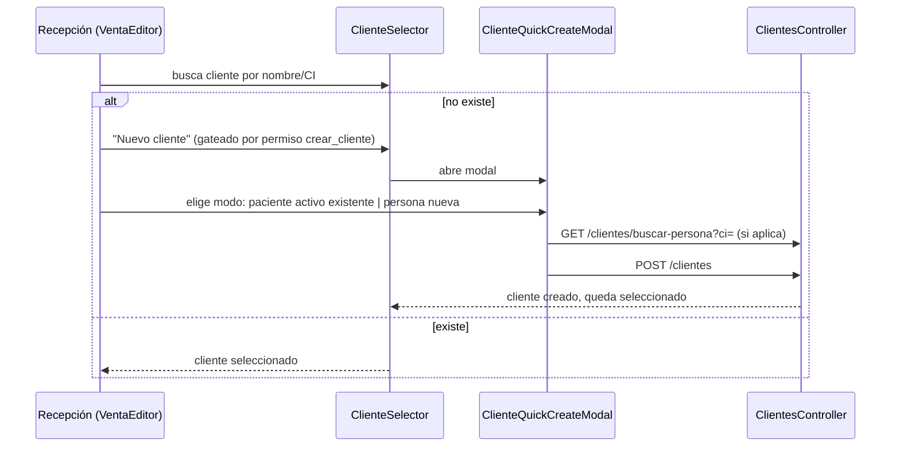

# Módulo: Clientes

## Propósito

Gestiona el ABM de clientes de venta — distintos de los pacientes clínicos, aunque pueden ser la misma persona física — con sus datos de facturación (persona física o jurídica). Es el módulo que le da a `Venta` a quién facturarle.

## Entidades principales

| Entidad | Rol |
|---|---|
| `Cliente` | Identidad de facturación de una `Person`: tipo (física/jurídica), razón social, RUC/CI fiscal, contacto. Ver `../schema.md` Grupo A. |

## Reglas de negocio clave

- **`Cliente` siempre cuelga de `Person`** (FK único `PersonId`) — no es una entidad de facturación separada. `TipoFacturacion` + `RazonSocial` + `RucCiFiscal` + `Direccion`/`Email`/`Telefono` son simplemente el dato de facturación de esa persona *en su rol de cliente*. Ver [ADR 0001 — Person como raíz de identidad](../adr/0001-person-como-raiz-de-identidad.md).
- **`Cliente` y `Patient` pueden compartir la misma `Person`** sin relación directa entre ellos — se relacionan únicamente a través de `Person` (no hay FK `Cliente↔Patient`). Un paciente que además compra productos no genera una persona duplicada.
- **Alta por reutilización de `Person`:** `GET /api/clientes/buscar-persona?ci=` busca si ya existe una `Person` con esa CI; si existe, se reutiliza (evita duplicar datos si la persona ya es paciente); si no, se crea una nueva junto con el `Cliente`.
- **No hay borrado físico simple:** `DELETE /api/clientes/{id}` desactiva (soft delete); reactivar es `POST /api/clientes/{id}/activar`. En el frontend, ambas acciones viven exclusivamente en el menú contextual de la tabla (modales de confirmación verde/rojo), nunca en el formulario de edición.
- **`Venta.ClienteId` es nullable** — `null` significa "Consumidor Final", una venta no exige tener un cliente registrado.
- **Origen histórico:** hasta la migración `035_Clientes`, los datos de facturación colgaban 1:1 de `Patient` (`DatosFacturacion`, hoy eliminada); esa migración copió los datos existentes hacia `Cliente` (mapeando `PatientId`→`PersonId`) y dropeó la tabla vieja.

## Endpoints

| Método | Ruta | Descripción |
|---|---|---|
| GET | `/api/clientes` | Listado paginado (filtros: búsqueda, estado, tipo) |
| GET | `/api/clientes/{id}` | Detalle |
| GET | `/api/clientes/buscar-persona?ci=` | Busca `Person` existente por CI, para reutilizar al dar de alta |
| POST | `/api/clientes` | Alta |
| PUT | `/api/clientes/{id}` | Edición |
| DELETE | `/api/clientes/{id}` · `POST /{id}/activar` | Desactivar / reactivar |

Detalle completo (policies, DTOs) en [`../api-reference.md`](../api-reference.md) § 2. Personas (`ClientesController`).

## Flujo típico

Alta de cliente durante el armado de una venta (el caso de uso más frecuente en la práctica, más que el ABM directo):

## Vistas de frontend

- `ClientesView.vue` — ABM principal (listado, alta/edición, activar/desactivar por menú contextual).
- `ClienteSelector.vue` (componente, no vista) — buscador de clientes activos + opción "Consumidor Final" + botón "Nuevo cliente", usado embebido en los editores de venta/presupuesto.
- `ClienteQuickCreateModal.vue` (componente) — alta rápida en dos modos (paciente activo existente / persona nueva) con datos de facturación, invocado desde `ClienteSelector`.

## Estado

✅ Implementado, integrado con Ventas desde 2026-06-07 (`Venta.ClienteId` reemplazó a la referencia previa por `PatientId`). `ventasService` y todas las vistas de venta/presupuesto/trabajo muestran `clienteNombre`, con fallback a "Consumidor Final".