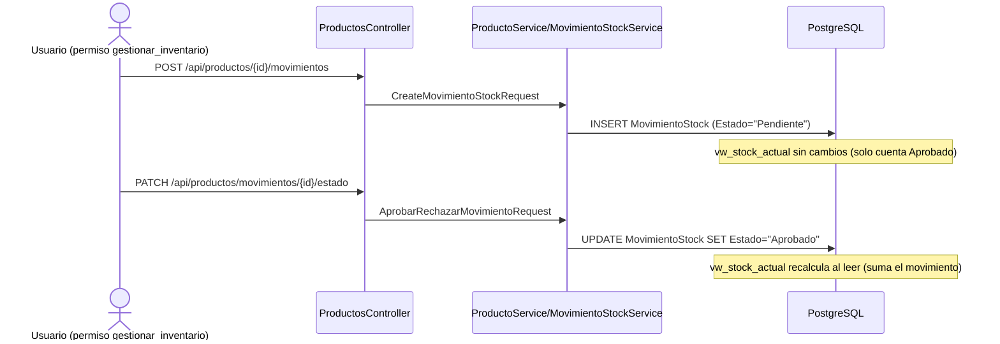

# Módulo: Inventario / Catálogo

## Propósito

Administra el catálogo de productos de la óptica (armazones, accesorios y el catálogo óptico legado de cristales) y controla el stock por sucursal mediante un registro auditable de movimientos, en vez de un campo mutable. Incluye trazabilidad de lotes con vencimiento, conteos físicos periódicos con ajuste, y el catálogo de clasificaciones ópticas (`TipoLente`, `Tratamiento`) que consume el módulo de Ventas para el flujo "a pedido".

## Entidades principales

| Entidad | Rol |
|---|---|
| `Producto` | Ítem de catálogo con stock (armazones, accesorios); `PrecioVenta` siempre derivado |
| `CategoriaProducto` | Categoría con `Margen` (define el precio de venta) y `Tipo` (Genérico/Armazón/**Cristal obsoleto**) |
| `Marca` / `Modelo` | Catálogo jerárquico de marca → modelo |
| `ProductoStockConfig` | Mín/máx de stock, 1:1 con `Producto`, **global** (no por sucursal) |
| `MovimientoStock` | Entrada/Salida con `Estado` Pendiente/Aprobado/Rechazado — única fuente del stock real |
| `MotivoMovimiento` | Catálogo de motivos, filtra por tipo de movimiento |
| `StockLote` | Trazabilidad de lotes con `FechaVencimiento`, originados en una recepción |
| `ConteoInventario` / `ConteoInventarioLinea` | Conteo físico periódico con diferencia sistema-vs-físico |
| `StockActualView` | Entidad de solo lectura sobre la vista SQL `vw_stock_actual` |
| `TipoLente` | Diseño de lente (monofocal/bifocal/progresivo/ocupacional) con `PrecioBase` — usado por Ventas/Laboratorio |
| `Tratamiento` | Tratamiento óptico con precio (antirreflejo, fotocromático, etc.) — N:N con `TrabajoPedido` |
| `TransferenciaStock` / `Item` | Transferencia entre sucursales — detalle completo en [`15-sucursales.md`](./15-sucursales.md) |

Ver diagrama ER completo en [`../schema.md`](../schema.md) § Grupo B.

**Nota de agrupamiento:** `Servicio`/`ServicioTarifa` (exámenes con tarifa por profesional) se documentan en [`08-ventas.md`](./08-ventas.md), no acá — aunque suenan a "catálogo", sus DTOs y policies (`ver_ventas`/`gestionar_ventas`) son del dominio comercial (ver nota en `api-reference.md` § Catálogo/Inventario).

## Reglas de negocio clave

- **El stock no es un campo, se deriva de movimientos aprobados.** Ver [ADR 0002](../adr/0002-stock-derivado-de-movimientos.md). `vw_stock_actual` agrupa por producto + sucursal sumando `Entrada`(+)/`Salida`(−) con `Estado = "Aprobado"`.
- **`PrecioVenta` siempre derivado, nunca manual.** `PrecioCosto × (1 + CategoriaProducto.Margen/100)`, centralizado en `Producto.AplicarCosto`. Ver [ADR 0004](../adr/0004-precio-venta-derivado-por-margen.md). Cambiar el margen de una categoría recalcula todos sus productos.
- **El catálogo óptico de cristales está obsoleto.** `CategoriaProducto.Tipo = Cristal` ya no se ofrece al dar de alta categorías (se conserva solo por compatibilidad de datos existentes). El cristal a pedido se especifica en el `TrabajoPedido` del módulo Ventas, no como `Producto`. Ver [ADR 0007](../adr/0007-cristal-ya-no-es-producto-con-stock.md) — **no confundir con `TipoLente`/`Tratamiento` de esta lista, que siguen vigentes** (son la especificación del cristal, no un producto con stock).
- **`ProductoStockConfig` es global, no por sucursal** — decisión explícita para no romper la relación 1:1 durante la migración multi-sucursal; mín/máx por sucursal queda como refinamiento futuro (ver `../schema.md` § Grupo B).
- **Crear un conteo de inventario exige solo `ver_inventario`**; únicamente *gestionar* (aprobar/rechazar, lo que ajusta el stock) exige `gestionar_inventario` — asimetría real del código, no error de este documento.
- **Convención de estados inconsistente entre módulos:** `MovimientoStock.Estado`/`.Tipo`, `ConteoInventario.Estado` y `TransferenciaStock.Estado` son `string` libres, no enum C# (a diferencia de `Venta`/`TrabajoPedido`/`Egreso`, que sí son enums reales) — ver `../schema.md` § Patrones transversales.

## Endpoints

Detalle completo en [`../api-reference.md`](../api-reference.md) § 6 (Catálogo/Inventario). Resumen:

| Controller | Ruta base | Cubre |
|---|---|---|
| `ProductosController` | `/api/productos` | CRUD de productos, movimientos de stock, stock-config, imagen, y sub-recursos `categorias` (`CategoriaProducto`) |
| `MarcasController` | `/api/marcas` | CRUD de marcas y sub-recurso `modelos` (`Modelo`) |
| `TipoLentesController` | `/api/tipos-lente` | CRUD de diseños de lente |
| `TratamientosController` | `/api/tratamientos` | CRUD de tratamientos |
| `MotivosMovimientoController` | `/api/motivos-movimiento` | CRUD de motivos, filtrable por tipo |
| `StockLotesController` | `/api/stock/lotes` | Lotes con vencimiento + conteos físicos (crear/listar/gestionar) |
| `UbicacionesController` | `/api/ubicaciones` | `Departamento`/`Ciudad` — catálogo geográfico compartido con Sucursal/Proveedor, no exclusivo de este módulo |

## Flujo típico

**Movimiento de stock con aprobación:**

**Conteo físico:** cualquier usuario con `ver_inventario` registra un `ConteoInventario` con sus `ConteoInventarioLinea` (cantidad física por producto); el sistema calcula `Diferencia` contra `vw_stock_actual`. Solo un usuario con `gestionar_inventario` puede aprobar el conteo — la aprobación genera los `MovimientoStock` de ajuste necesarios para que el stock del sistema coincida con lo contado.

## Vistas de frontend

`ProductosView.vue`, `CategoriasProductoView.vue`, `MarcasView.vue`, `ModelosView.vue`, `TipoLentesView.vue`, `TratamientosView.vue`, `StockView.vue`, `MovimientosView.vue`, `MovimientoFormView.vue`, `MotivosMovimientoView.vue`, `ConteoFormView.vue`, `ConteoRevisarView.vue`, `ConteoAprobacionView.vue`, `ConteoAprobacionPendientesView.vue` (todas en `SIGA-Web/src/views/`).

## Estado

✅ Implementado y en uso. Deuda técnica conocida (no bugs, documentada explícitamente en el código/memoria):
- `ProductoStockConfig` global en vez de por sucursal.
- `Producto.Categoria` (string legado) puede desincronizarse de `CategoriaProductoId` si se renombra una categoría — no se re-vincula automáticamente (ver [ADR 0004](../adr/0004-precio-venta-derivado-por-margen.md) § Consecuencias).
- Categorías con `Tipo = Cristal` y sus productos asociados quedan como datos legado inactivos, sin ofrecerse en altas nuevas.
