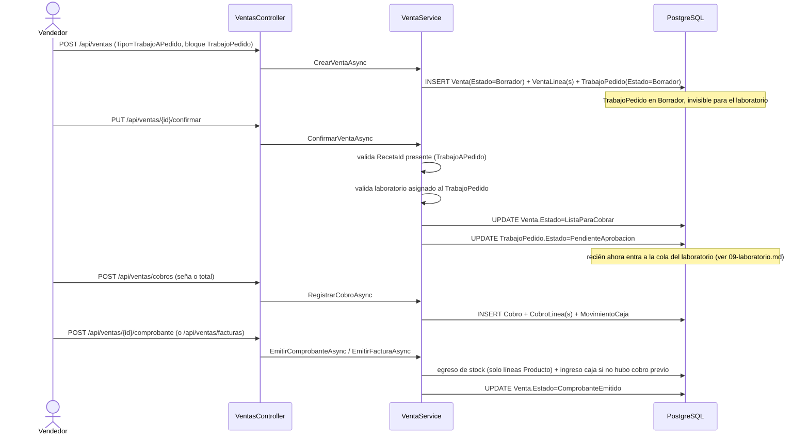

# Módulo: Ventas

## Propósito

Registra las ventas de la óptica en dos modalidades sobre una misma cabecera (`Venta.Tipo`): **venta directa** de mostrador (productos/servicios de stock inmediato) y **venta "a pedido"** óptica (armazón + cristal a medida + tratamientos + laboratorio externo, con receta obligatoria al confirmar). Cubre también presupuestos (la misma entidad `Venta` en estado `Borrador`), cobro flexible (contado/crédito, métodos combinados), emisión de documento fiscal (recibo simple o factura timbrada con numeración automática) y devoluciones/cambios.

## Entidades principales

| Entidad | Rol |
|---|---|
| `Venta` | Cabecera única para venta directa, presupuesto y venta a pedido (`Tipo`/`Estado`) |
| `VentaLinea` | Línea de producto, servicio o lente a pedido (`Tipo`) |
| `Cliente` | A quién se le vende (nullable = Consumidor Final) — ver [`06-clientes.md`](./06-clientes.md) |
| `Cobro` / `CobroLinea` | Pago (seña o cuota) con métodos combinados |
| `FacturaVenta` / `Comprobante` | Los dos documentos fiscales posibles, mutuamente excluyentes |
| `Timbrado` | Serie fiscal con numeración correlativa automática |
| `Devolucion` / `DevolucionLinea` | Devolución o cambio de producto post-venta |
| `TrabajoPedido` | El "pedido óptico" de una venta a pedido — detalle completo en [`09-laboratorio.md`](./09-laboratorio.md) |
| `Receta` | Graduación que respalda una venta a pedido — ver [`05-clinica.md`](./05-clinica.md) |
| `Servicio` / `ServicioTarifa` | Exámenes/servicios con tarifa por profesional o especialidad, vendibles como línea |

Ver diagrama ER completo en [`../schema.md`](../schema.md) § Grupo C.

## Reglas de negocio clave

- **Precio de línea autocompleta desde `Producto.PrecioVenta`** (derivado por margen, [ADR 0004](../adr/0004-precio-venta-derivado-por-margen.md)) pero queda editable por línea para un ajuste puntual.
- **El cristal a pedido ya no es un `Producto` con stock.** Se especifica en el `TrabajoPedido` como `TipoLente` (diseño, con `PrecioBase` que autocompleta el precio) + `Tratamiento`s + precio editable. En `VentaLinea` esto se representa como `Tipo = Lente`, **sin `ProductoId`** — no descuenta stock. Ver [ADR 0007](../adr/0007-cristal-ya-no-es-producto-con-stock.md).
- **El `TrabajoPedido` de una venta a pedido nace en `Borrador`** junto al presupuesto, editable libremente y **sin aparecer en la cola del laboratorio**. Al confirmar la venta, si sigue en `Borrador`, se exige asignar laboratorio y pasa a `PendienteAprobacion`. Ver [ADR 0005](../adr/0005-trabajopedido-nace-en-borrador.md).
- **Confirmar una venta `TrabajoAPedido` exige `RecetaId`.** La receta puede ser de una consulta clínica o cargada manualmente para el cliente (receta "externa") — ver [`05-clinica.md`](./05-clinica.md).
- **El cobro está desacoplado del ciclo del laboratorio.** Toda venta confirmada (directa o a pedido) pasa directo a `ListaParaCobrar`; el envío/recepción del trabajo en el laboratorio corre en paralelo sin bloquear el cobro. `EstadoVenta.EnProceso` quedó sin uso para ventas nuevas. Ver [ADR 0006](../adr/0006-cobro-desacoplado-del-laboratorio.md).
- **Documento fiscal: recibo o factura, nunca ambos.** `Comprobante` (recibo simple) y `FacturaVenta` (factura timbrada) son mutuamente excluyentes sobre la misma `Venta`; ambos producen los mismos efectos (egreso de stock por línea de producto + ingreso de caja, **sin duplicar** si ya hubo cobros previos) y mueven la venta a `ComprobanteEmitido`. La emisión es un paso dedicado (`VentaComprobanteView`), separado de la pantalla de cobro.
- **Numeración de factura automática por timbrado.** Al emitir una factura, el cajero elige un `Timbrado` activo y vigente; el backend genera `{Establecimiento}-{PuntoExpedicion}-{correlativo:D7}` y avanza `Timbrado.UltimoNumero` — no hay carga manual del número (`VentaService`, confirmado en código: `EmitirFacturaRequest` solo lleva `TimbradoId`, no número/establecimiento manuales).
- **`Servicio`/`ServicioTarifa`** permiten un precio distinto por profesional o por especialidad para el mismo servicio (ej. examen); `GET /api/servicios/{id}/precio?professionalId=` resuelve el precio aplicable en el momento de armar la línea.

## Endpoints

Detalle completo en [`../api-reference.md`](../api-reference.md) § 7 (Ventas) — `VentasController`, `TimbradosController` — y § 6 para `ServiciosController` (agrupado ahí en el documento por archivo de origen, pero funcionalmente de este módulo). Flujo de estados de `Venta` cubierto por: `POST /api/ventas` (crea presupuesto/borrador, con bloque opcional `TrabajoPedido`) → `PUT /api/ventas/{id}/confirmar` → `POST /api/ventas/cobros` (uno o más) → `POST /api/ventas/{id}/comprobante` **o** `POST /api/ventas/facturas`.

## Flujo típico

**Venta a pedido, de presupuesto a comprobante:**

El laboratorio sigue su propio ciclo (envío → recepción → factura de laboratorio) en paralelo desde que el `TrabajoPedido` pasa a `PendienteAprobacion` — no bloquea ni es bloqueado por el cobro. Ver [`09-laboratorio.md`](./09-laboratorio.md).

## Vistas de frontend

`VentasView.vue`, `VentasNuevaView.vue`, `PresupuestosView.vue`, `PresupuestoNuevoView.vue` (wrappers del editor unificado), `components/VentaEditor.vue` (prop `esPresupuesto`, toggle A pedido/Directa), `VentaDetalleView.vue`, `VentaCobrarView.vue`, `VentaComprobanteView.vue`, `CobrosPendientesView.vue`, `FacturasVentaView.vue`, `FacturaDetailView.vue`, `TimbradosView.vue`, `VentasCierreView.vue`; componentes `components/RecetaSelector.vue`, `components/TrabajoOpticoCard.vue`, `components/ClienteSelector.vue`, `components/ClienteQuickCreateModal.vue`, y el composable `composables/optica.ts` (arma `OpticaState` → líneas + bloque `TrabajoPedido`). No se encontró una vista dedicada de devoluciones/cambios (`Devolucion`) — probablemente inline en `VentaDetalleView.vue`; confirmar si se documenta este módulo con más detalle.

## Estado

✅ Implementado y verificado (build backend + `vue-tsc` en verde según memoria de proyecto). Notas:
- El flujo de "generar venta desde presupuesto" carga líneas + cliente + receta y confirma, pero **no rehidrata** la `TrabajoOpticoCard` (la config óptica ya quedó fija en el `TrabajoPedido` del presupuesto) — no hay endpoint para editar receta/laboratorio de un presupuesto existente al confirmarlo.
- `Venta` tiene varios totales (`Total`, `MontoSeña`, `TotalCobrado`, `SaldoPendiente`, montos por categoría fiscal) que son propiedades **calculadas en memoria** (`Ignore()`d por EF), no columnas — no confundir con datos persistidos al leer el schema.

## Auditoría de documentos previos

Este módulo absorbe y reemplaza 3 documentos de progreso vivo que existían en `docs/` antes de esta reescritura (2026-07-08) — quedan en el repo como referencia histórica, marcados con una nota de auditoría al final de cada uno:

- **`../ventas-emision-comprobante.md`** — vigente y confirmado contra código: el flujo de recibo/factura excluyente descrito arriba coincide con `VentaService` actual.
- **`../ventas-modelo-lentes.md`** — vigente y confirmado: es la fuente original de la decisión que hoy es [ADR 0007](../adr/0007-cristal-ya-no-es-producto-con-stock.md); el código ya no tiene `TrabajoPedido.CristalProductoId` tal como este documento planificaba.
- **`../ventas-timbrados-abm.md`** — **su encabezado decía "🟡 Planificado — pendiente de implementación", pero está desactualizado: ya está implementado.** Se confirmó en código (`VentaService.cs`: genera `NumeroFactura` desde `Timbrado.UltimoNumero + 1` y lo persiste) y en `api-reference.md` (`TimbradosController` completo). El plan ahí descrito coincide con el comportamiento real.
