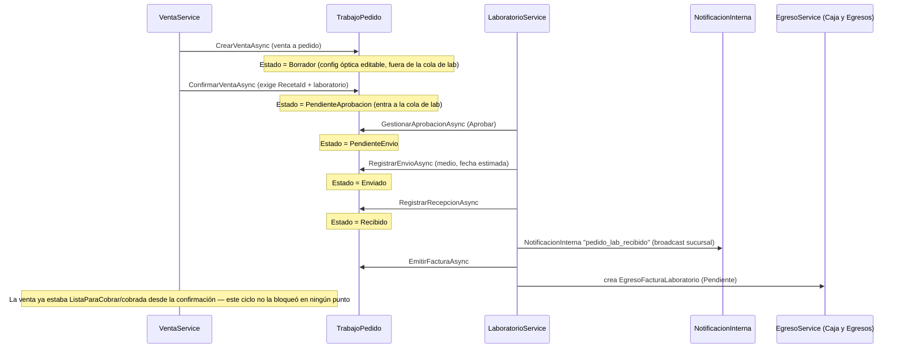

# Módulo: Laboratorio

## Propósito

Gestiona el ciclo de vida de un `TrabajoPedido` (la parte "a pedido" de una venta óptica: cristal graduado + armazón + tratamientos) una vez que la venta que lo originó fue confirmada — desde que se aprueba internamente hasta que el laboratorio externo lo fabrica, lo envía, se recibe y se factura. Se separó de Ventas el 2026-06-08 porque el ciclo de vida de "fabricar y recibir un pedido de un proveedor externo" es operativamente distinto del ciclo de venta/cobro.

## Entidades principales

| Entidad | Rol |
|---|---|
| `TrabajoPedido` | Núcleo del módulo — 1:1 con la `Venta` que lo originó. Ver [`schema.md` § Grupo C](../schema.md#grupo-c--comercial-ventas-laboratorio-compras-caja-y-egresos). |
| `FacturaLaboratorio` | Factura del laboratorio externo, 1:1 con `TrabajoPedido` (`Cascade`). |
| `Proveedor` (`EsLaboratorio=true`) | El mismo catálogo de proveedores de Compras sirve como catálogo de laboratorios ópticos externos. |
| `TipoLente` / `Tratamiento` | Especificación del cristal a pedido (ver nota de catálogo óptico en `schema.md` Grupo B — el cristal **no** es un `Producto`). |
| `EgresoFacturaLaboratorio` | Subtipo de `Egreso` (TPH) creado automáticamente al emitir la factura del laboratorio — ver módulo [Caja y Egresos](./11-caja-y-egresos.md). |

## Reglas de negocio clave

- El `TrabajoPedido` **nace en estado `Borrador`** junto con el presupuesto/venta, y no aparece en la cola de laboratorio hasta que la venta se confirma. Ver [ADR 0005](../adr/0005-trabajopedido-nace-en-borrador.md). `GetPedidosAsync` excluye explícitamente `Borrador`.
- El **cobro de la venta está desacoplado** del ciclo de laboratorio: la venta pasa a `ListaParaCobrar` al confirmarse, sin esperar a que el laboratorio reciba o entregue nada. `RegistrarRecepcionAsync` **no** toca el estado de la `Venta`. Ver [ADR 0006](../adr/0006-cobro-desacoplado-del-laboratorio.md).
- El ciclo de estados es **lineal y estricto** — cada transición valida el estado actual exacto y rechaza si no corresponde (`PendienteAprobacion`→`PendienteEnvio`/`Rechazado`→`Enviado`→`Recibido`, factura solo desde `Recibido`).
- Al **emitir la factura del laboratorio** (`EmitirFacturaAsync`), el servicio crea automáticamente un `EgresoFacturaLaboratorio` (`Estado = Pendiente`) además de la `FacturaLaboratorio` — el pago real de esa factura se gestiona luego desde el módulo de Egresos, no desde Laboratorio.
- Solo puede haber **una factura por `TrabajoPedido`** (`tp.Factura != null` bloquea una segunda).
- Al recibir un pedido, se genera una `NotificacionInterna` de tipo `pedido_lab_recibido` dirigida a toda la sucursal de la venta (broadcast por sucursal, no a un usuario puntual).

## Endpoints

Ver [`api-reference.md` § 8. Laboratorio](../api-reference.md#8-laboratorio) para la tabla completa (`LaboratorioController`, `/api/laboratorio/pedidos*`, policies `ver_laboratorio`/`gestionar_laboratorio`).

| Método | Ruta | Transición |
|---|---|---|
| GET | /api/laboratorio/pedidos | Listado (excluye `Borrador`) |
| POST | /api/laboratorio/pedidos/{id}/gestionar | `PendienteAprobacion` → `PendienteEnvio` \| `Rechazado` |
| PUT | /api/laboratorio/pedidos/{id}/enviar | `PendienteEnvio` → `Enviado` |
| PUT | /api/laboratorio/pedidos/{id}/recibir | `Enviado` → `Recibido` |
| POST | /api/laboratorio/pedidos/{id}/factura | `Recibido` → (sin cambio de estado del TP; crea `FacturaLaboratorio` + `EgresoFacturaLaboratorio`) |

## Flujo típico

## Vistas de frontend

Rutas bajo `/laboratorio/*` (`SIGA-Web/src/router/index.ts`), grupo de menú "Laboratorio":

| Vista | Ruta | Permiso |
|---|---|---|
| `TrabajosPedidoView.vue` | `/laboratorio/pedidos` | `ver_laboratorio` |
| `TrabajosPedidoAprobacionView.vue` | `/laboratorio/aprobaciones` | `gestionar_laboratorio` |
| `TrabajosPedidoRecepcionesView.vue` | `/laboratorio/recepciones` | `gestionar_laboratorio` |
| `TrabajosPedidoFacturasView.vue` | `/laboratorio/facturas` | `gestionar_laboratorio` |

`VentaDetalleView.vue` también expone acciones de crear/enviar/recibir el TP asociado a una venta puntual (repunteadas a `laboratorioService`, no a `ventasService`).

## Estado

✅ Implementado end-to-end (backend + frontend), verificado contra código el 2026-07-08. Sin limitaciones conocidas propias del módulo — las limitaciones del flujo óptico en general (no poder editar receta/laboratorio de un presupuesto ya confirmado) están documentadas en [`08-ventas.md`](./08-ventas.md).
