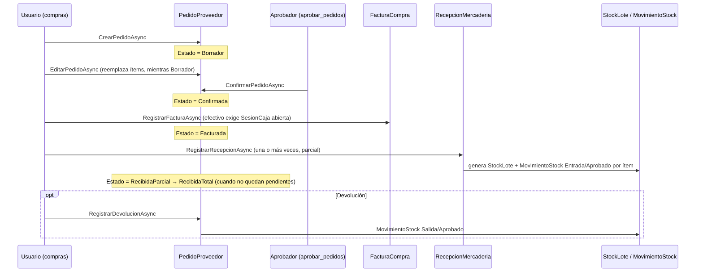

# Módulo: Compras

## Propósito

Gestiona el ciclo de abastecimiento de mercadería desde proveedores externos: alta de proveedores, órdenes de compra (OC), registro de la factura del proveedor, recepción física de la mercadería (con generación de lotes y stock) y devoluciones al proveedor.

## Entidades principales

| Entidad | Rol |
|---|---|
| `Proveedor` / `ProveedorContacto` | Catálogo de proveedores (compartido con Laboratorio vía el flag `EsLaboratorio`). |
| `PedidoProveedor` / `PedidoProveedorItem` | La orden de compra (OC) y sus líneas. |
| `FacturaCompra` (subtipo de `Egreso`, TPH) | Factura del proveedor — ver [Caja y Egresos](./11-caja-y-egresos.md) para la jerarquía completa. |
| `RecepcionMercaderia` / `RecepcionMercaderiaItem` | Recepción física (puede ser parcial, una OC admite varias). |
| `StockLote` | Generado por cada línea de recepción con lote/vencimiento (ver [`07-inventario-catalogo.md`](./07-inventario-catalogo.md)). |
| `DevolucionProveedor` | Devolución de mercadería ya recibida hacia el proveedor. **No confundir con `Devolucion`/`DevolucionLinea`**, que es la devolución/cambio del lado del cliente en una `Venta` — ver [`08-ventas.md`](./08-ventas.md). Son dos entidades distintas sin relación entre sí, solo comparten la palabra "devolución". |

Ver [`schema.md` § Grupo C](../schema.md#grupo-c--comercial-ventas-laboratorio-compras-caja-y-egresos) para el diccionario de datos completo.

## Reglas de negocio clave

- **Orden real del ciclo — distinta de lo que sugiere el orden de lectura del enum `EstadoPedido`.** El código exige: `Borrador` → `Confirmada` (`ConfirmarPedidoAsync`) → **`Facturada`** (`RegistrarFacturaAsync`, exige estado exacto `Confirmada`) → **luego** `RecibidaParcial`/`RecibidaTotal` (`RecepcionesService`, exige estado `Facturada` o `RecibidaParcial` para aceptar una recepción). Es decir: **la factura del proveedor se registra antes de recibir físicamente la mercadería**, no después — a diferencia de lo que suele asumirse por el nombre de los estados. Verificado leyendo `ComprasService.RegistrarFacturaAsync` (línea ~149) y `RecepcionesService` (línea ~126) directamente, el 2026-07-08.
- Una OC solo se puede **editar** (reemplazo completo de ítems) mientras está en `Borrador`.
- Una OC **no se puede cancelar** si ya está `RecibidaTotal`.
- Las **devoluciones a proveedor** (`DevolucionProveedor`) solo se permiten sobre OCs con mercadería recibida (`RecibidaTotal`/`RecibidaParcial`), y la cantidad a devolver no puede superar la cantidad recibida del ítem. Cada devolución genera un `MovimientoStock` de `Salida` en estado `Aprobado` (descuenta stock inmediatamente, sin flujo de aprobación adicional).
- Alta de proveedor exige **al menos un contacto con nombre** (validado en backend y frontend).
- El pago en efectivo de una factura de compra exige una `SesionCaja` **abierta** en la sucursal — si no hay, la operación falla explícitamente en vez de crear un movimiento huérfano.

## Endpoints

Ver [`api-reference.md` § 9. Compras](../api-reference.md#9-compras) para la tabla completa (`ComprasController`, `ProveedoresController`, `FacturasCompraController`, `RecepcionesController`).

| Método | Ruta | Transición / acción |
|---|---|---|
| POST | /api/compras/pedidos | Crea OC en `Borrador` |
| PUT | /api/compras/pedidos/{id}/confirmar | `Borrador` → `Confirmada` (policy `aprobar_pedidos`, distinta de crear/editar) |
| POST | /api/compras/pedidos/{id}/factura | `Confirmada` → `Facturada` |
| POST | /api/compras/recepciones | `Facturada`/`RecibidaParcial` → `RecibidaParcial`/`RecibidaTotal` (según si quedan ítems pendientes) |
| POST | /api/compras/pedidos/{id}/devolucion | Devolución sobre OC recibida (no cambia el estado de la OC) |
| PUT | /api/compras/pedidos/{id}/cancelar | → `Cancelada` (policy OR: creador `gestionar_pedidos` o aprobador `aprobar_pedidos`) |

## Flujo típico

## Vistas de frontend

Rutas bajo `/compras/*` (`SIGA-Web/src/router/index.ts`):

| Vista | Ruta |
|---|---|
| `PedidosView.vue` | `/compras/oc` |
| `OcFormView.vue` | `/compras/oc/nueva`, `/compras/oc/:id/editar` |
| `OcDetailView.vue` | `/compras/oc/:id` |
| `OcAprobacionView.vue` | `/compras/aprobaciones` |
| `FacturasCompraView.vue` / `FacturaFormView.vue` / `FacturaDetailView.vue` | `/compras/facturas*` |
| `RecepcionesView.vue` / `RecepcionFormView.vue` / `RecepcionDetailView.vue` (además `RecepcionView.vue`, confirmar cuál es la vigente) | `/compras/recepciones*` |
| `ProveedoresView.vue` | (fuera de `/compras`, ruta propia — confirmar en router) |
| `ReportesComprasView.vue` | `/compras/reportes` |

No hay una vista dedicada a `DevolucionProveedor` — la acción vive embebida en `OcDetailView.vue` (a confirmar visualmente si se documenta a nivel de UI en detalle).

## Estado

✅ Implementado end-to-end. ⚠️ Nota de documentación (no de bug): el orden factura-antes-que-recepción es una decisión de negocio real del código, no un error — pero conviene que quien lea `schema.md` no asuma el orden "recibir y después facturar" solo por el nombre de los estados intermedios del enum `EstadoPedido`.
