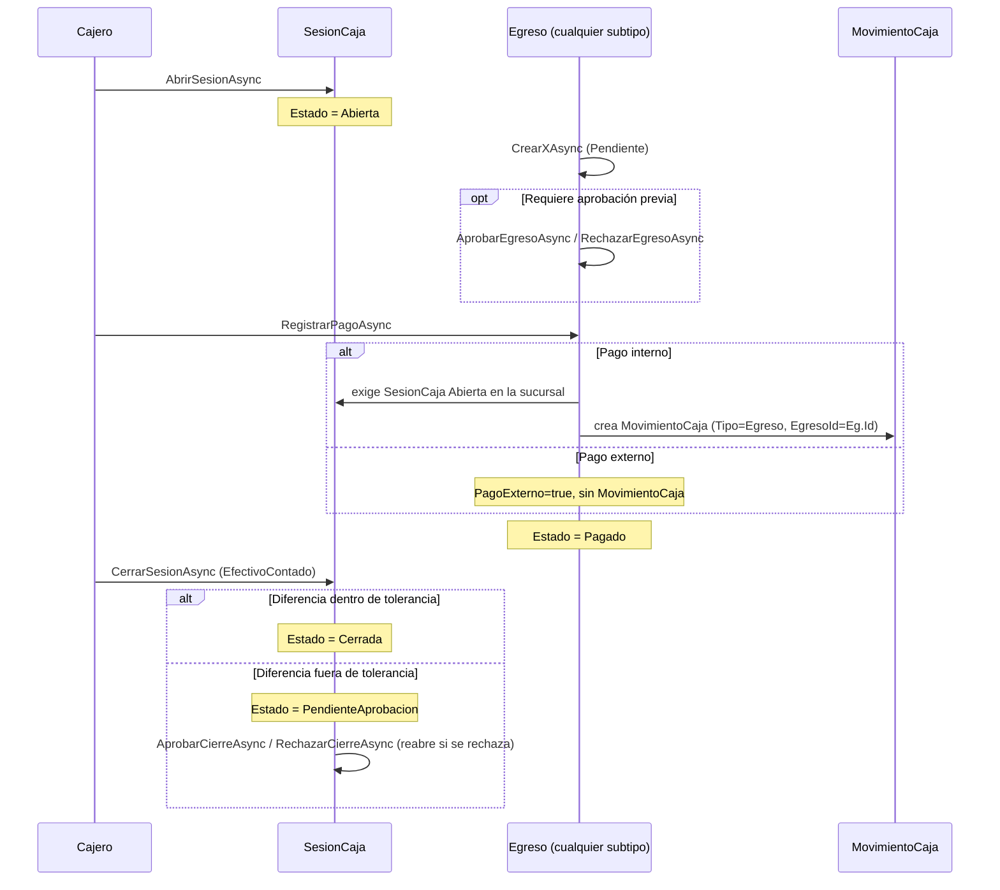

# Módulo: Caja y Egresos

## Propósito

Dos dominios estrechamente acoplados: **Caja** controla el efectivo físico por sucursal (apertura/cierre de sesión, arqueo) y registra todo movimiento de dinero (ingreso o egreso); **Egresos** modela las distintas formas en que el negocio gasta dinero (factura de proveedor, honorario profesional, gasto general, salario, factura de laboratorio) bajo una única jerarquía de datos.

## Entidades principales

| Entidad | Rol |
|---|---|
| `SesionCaja` | Una caja abierta por sucursal a la vez. Apertura con monto inicial, cierre con arqueo físico. |
| `MovimientoCaja` | Cada entrada/salida de dinero, siempre asociada a una `SesionCaja`; opcionalmente a una `Venta` (cobro) o un `Egreso` (pago). |
| `Egreso` (clase base TPH) | Ver [ADR 0011](../adr/0011-egreso-como-jerarquia-tph.md) — una única tabla física `egresos`, discriminador `Tipo` (`TipoEgreso`). |
| `FacturaCompra` / `Honorario` / `GastoGeneral` / `SalarioEmpleado` / `EgresoFacturaLaboratorio` | Los 5 subtipos concretos de `Egreso`. |
| `CategoriaGasto` | Catálogo para clasificar `GastoGeneral` (sin controller propio — vive bajo `EgresosController`). |

Ver [`schema.md` § Grupo C](../schema.md#grupo-c--comercial-ventas-laboratorio-compras-caja-y-egresos) para el diccionario de datos completo, y el [ADR 0011](../adr/0011-egreso-como-jerarquia-tph.md) para el razonamiento detrás de la herencia TPH.

## Reglas de negocio clave

- **Una sola `SesionCaja` abierta por sucursal a la vez** (`AbrirSesionAsync` rechaza si ya hay una `Abierta` o `PendienteAprobacion`). El monto de apertura, si no se especifica, se autocompleta con el `EfectivoContado` del último cierre de esa sucursal (el efectivo del cajón se traslada entre sesiones).
- **Cierre con tolerancia de arqueo:** al cerrar, se calcula `EfectivoEsperado = MontoInicial + ingresosEfectivo - egresosEfectivo` y se compara contra `EfectivoContado` (conteo físico). Si la diferencia está dentro de la tolerancia (±50.000, hardcodeada como constante `Tolerancia` en `CajaService`), la sesión pasa directo a `Cerrada`; si la excede, pasa a `PendienteAprobacion` y requiere que alguien con `aprobar_cierres_caja` la apruebe o la rechace. Rechazar **reabre** la sesión (vuelve a `Abierta`, limpiando los campos de cierre) para que el cajero pueda re-arquear.
- **`Egreso` centraliza sus propias transiciones de estado como métodos de dominio** (`egreso.RegistrarPago(...)`, `.Aprobar()`, `.Rechazar(motivo)`), no como lógica dispersa en el servicio — lanzan `InvalidOperationException` si la transición no es válida en el estado actual, que el servicio traduce a `ErrorType.Conflict`.
- **Pago externo:** un egreso puede pagarse "fuera de caja" (`PagoExterno=true` + `MotivoPagoExterno` obligatorio) sin generar `MovimientoCaja` ni exigir sesión abierta — para pagos que no pasaron por la caja física del negocio.
- Un egreso **pagado no se puede anular**; solo egresos en otros estados.
- **Dos caminos generan una `FacturaCompra`, no uno solo:** (a) `POST /api/egresos/facturas` (alta directa, sin OC) y (b) `ComprasService.RegistrarFacturaAsync` cuando la factura está ligada a una `PedidoProveedor` (ver [`10-compras.md`](./10-compras.md)). Ambos crean el mismo tipo de entidad `Egreso`/`FacturaCompra`, por caminos de código distintos.
- ⚠️ **Inconsistencia real encontrada (2026-07-08):** al pagar un egreso vía `EgresoService.RegistrarPagoAsync`, el `MovimientoCaja` generado sí se vincula correctamente (`EgresoId = egreso.Id`). Pero cuando `ComprasService.RegistrarFacturaAsync` paga una `FacturaCompra` en efectivo *en el mismo paso* que la crea, el `MovimientoCaja` que genera queda con `EgresoId = null` (comentario en el propio código: `// se actualizará tras SaveChanges si se requiere` — no se ve una actualización posterior). Es una inconsistencia de código real entre los dos caminos de pago, no un error de esta documentación — vale la pena revisarla aparte.
- El route guard del frontend en `/egresos/pagos/:id` exige el permiso `pagar_egresos`, que **no aparece** en la tabla de policies documentada para `PUT /api/egresos/{id}/pago` en `api-reference.md` (ahí figura `gestionar_egresos`, con chequeo adicional de `aprobar_egresos` solo para pago externo). Confirmar si `pagar_egresos` es un permiso real del backend o un meta de ruta desactualizado en el frontend.

## Endpoints

Ver [`api-reference.md` § 10. Caja y Egresos](../api-reference.md#10-caja-y-egresos) para la tabla completa (`CajaController`, `EgresosController`).

| Método | Ruta | Acción |
|---|---|---|
| POST | /api/caja/sesiones | Abrir sesión de caja |
| POST | /api/caja/sesiones/{id}/cerrar | Cerrar con arqueo → `Cerrada` o `PendienteAprobacion` |
| POST | /api/caja/sesiones/{id}/aprobar-cierre \| rechazar-cierre | Resolver una diferencia de arqueo |
| POST | /api/egresos/{facturas\|honorarios\|salarios\|gastos} | Crear el subtipo correspondiente de `Egreso` |
| PUT | /api/egresos/{id}/pago | Registrar pago (interno → `MovimientoCaja`, o externo) |
| PUT | /api/egresos/{id}/{aprobar\|rechazar\|anular} | Transiciones de estado |

## Flujo típico

## Vistas de frontend

Rutas bajo `/caja/*` y `/egresos/*` (`SIGA-Web/src/router/index.ts`):

| Vista | Ruta | Permiso |
|---|---|---|
| `CajaHistorialView.vue` | `/caja/historial` | `ver_ventas` |
| `CajaAprobacionesView.vue` | `/caja/aprobaciones` | `aprobar_cierres_caja` |
| `EgresosView.vue` | `/egresos` | `ver_egresos` |
| `NuevoEgresoView.vue` | `/egresos/nuevo` | `gestionar_egresos` |
| `AprobacionEgresosView.vue` | `/egresos/aprobacion` | `aprobar_egresos` |
| `PagosEgresosView.vue` / `PagoEgresoView.vue` | `/egresos/pagos`, `/egresos/pagos/:id` | `pagar_egresos` (ver nota de inconsistencia arriba) |
| `CategoriasGastoView.vue` | `/egresos/categorias` | `ver_egresos` |

## Estado

✅ Implementado end-to-end. ⚠️ Dos hallazgos de código reales anotados arriba (inconsistencia de `MovimientoCaja.EgresoId` sin setear en un camino de pago, y posible desalineación del permiso `pagar_egresos`) — quedan para revisión de código aparte, no bloquean el uso del módulo.
