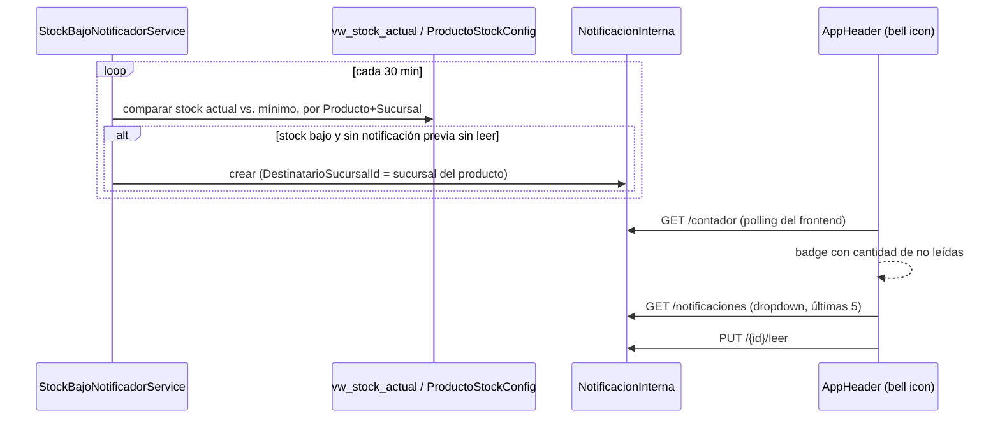

# Módulo: Notificaciones

## Propósito

Centro de alertas internas para el staff de la óptica: avisa de eventos que requieren atención (stock bajo, una transferencia de stock pendiente de aceptar, un pedido de laboratorio recibido) sin que nadie tenga que revisar manualmente cada pantalla. Es la Fase 1 de un módulo más grande de 5 fases que eventualmente cubrirá también notificaciones externas a pacientes (email/WhatsApp).

## Entidades principales

| Entidad | Rol |
|---|---|
| `NotificacionInterna` | Una alerta: destinatario (usuario / sucursal / global), tipo, mensaje, leída o no |

Ver `../schema.md` (entidad transversal, no pertenece a ninguno de los 3 grupos del DER — se referencia desde ahí).

## Reglas de negocio clave

- **Scoping de destinatario en 3 niveles**, resuelto vía `ICurrentUserContext`: `DestinatarioUsuarioId` (individual), `DestinatarioSucursalId` (broadcast a todo el staff de esa sucursal), o ambos `null` (broadcast global). No existe scoping por rol — los roles son dinámicos y `ICurrentUserContext` no expone el nombre de rol de forma robusta.
- **`Leido` es un único flag compartido** en las notificaciones de broadcast, no por-usuario — decisión explícita: si dos personas del staff comparten una notificación de sucursal, cuando una la marca como leída desaparece para ambas. Ver [ADR 0010](../adr/0010-notificaciones-internas-antes-que-externas.md).
- **Bug real encontrado y corregido durante esta fase:** la visibilidad de broadcasts usaba `ICurrentUserContext.EsGlobal` para decidir "¿puede ver avisos de todas las sucursales?" — pero `EsGlobal` (`SucursalId == null`) también es `true` para pacientes (son globales por diseño, ver [ADR 0009](../adr/0009-sucursal-fija-por-usuario.md)). Si un paciente llegaba a tener el permiso `ver_notificaciones`, veía los broadcasts operativos de todas las sucursales. Fix: exigir el permiso concreto `ver_todas_sucursales` en vez de inferirlo de `EsGlobal`. Regla general dejada para las fases futuras: nunca gatear visibilidad de datos de staff solo con `EsGlobal`.
- **Tres triggers reales conectados** (no hooks genéricos, cada uno cableado a mano):
  1. **Bajo stock** — `StockBajoNotificadorService`, un `BackgroundService` que hace polling cada 30 min (mismo patrón que `TurnoReminderService`) comparando `vw_stock_actual` contra `ProductoStockConfig` por Producto+Sucursal. Se eligió poller en vez de hook inline porque los movimientos de stock "Aprobado" se originan desde al menos 5 servicios distintos (Compras, Ventas, Recepciones, Conteos, Transferencias) — instrumentar los 5 hubiera sido más invasivo que un poller. No duplica si ya hay una notificación sin leer para el mismo producto+sucursal.
  2. **Transferencia pendiente** — hook directo en `TransferenciaStockService.CreateAsync`.
  3. **Pedido de laboratorio recibido** — hook directo en `LaboratorioService.RegistrarRecepcionAsync`.

## Endpoints

| Método | Ruta | Descripción |
|---|---|---|
| GET | /api/notificaciones?soloNoLeidas&page&pageSize | Notificaciones del usuario autenticado |
| GET | /api/notificaciones/contador | Cantidad de no leídas (badge del header) |
| PUT | /api/notificaciones/{id}/leer | Marca una como leída |
| PUT | /api/notificaciones/leer-todas | Marca todas como leídas |

Todos bajo policy `ver_notificaciones`. Ver `../api-reference.md` § 13.

## Flujo típico

Los otros dos triggers (transferencia pendiente, laboratorio recibido) son hooks síncronos dentro del flujo de negocio correspondiente, sin polling — se disparan en el mismo request que crea la transferencia o registra la recepción.

## Vistas de frontend

- `NotificacionesView.vue` — listado completo (reemplazó un placeholder `ComingSoonView` en `/notificaciones`)
- Bell icon + dropdown en `AppHeader.vue` (componente global, no vista): badge de contador, últimas 5, marcar leída, link "Ver todas"

## Estado

✅ **Fase 1 (centro interno) implementada y verificada end-to-end** contra la base de dev (Neon) el 2026-07-02: migración `055_NotificacionesInternas` aplicada sin tocar datos existentes, el poller de bajo stock generó 6 notificaciones reales al arrancar la API, los 4 endpoints probados con curl+JWT. Los hooks de transferencia y laboratorio-recibido se validaron solo por lectura de código (mismo patrón ya probado del trigger de bajo stock), no en vivo. `dotnet build`/`vue-tsc`/`npm run build` en verde.

**Corrección de estado (verificado con `git log` el 2026-07-08):** el commit `eb9f6c9 "Centro de notificaciones internas + gestión de contraseñas"` ya está en la rama `matias-gaona`, que está al día con `origin` — la memoria de proyecto decía "sin pushear" pero eso quedó desactualizado; **está pusheado**.

⚠️ **Pendiente (Fases 2-5, no implementadas):** preferencias de notificación por `Person`, log de notificaciones externas (migrar los emails de turnos que hoy se mandan directo sin log), notificación de pickup para ventas a pedido recibidas, plantillas + bitácora de envíos para admin.
