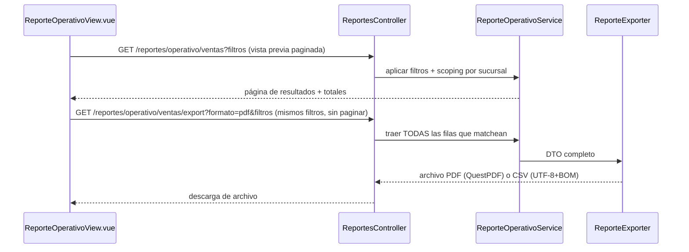

# Módulo: Reportes

## Propósito

Reportes **operativos de control** — listados filtrables con totales, exportables a PDF/CSV, para auditar el día a día (qué se vendió, qué se compró, qué movió stock, qué movió caja). Es distinto de los reportes **analíticos** (KPIs agregados del dashboard), que son client-side con `jsPDF` y no forman parte de este módulo.

## Entidades principales

Este módulo no tiene entidades propias — es una capa de agregación/exportación sobre entidades ya documentadas en `../schema.md`:

| Reporte | Entidades fuente |
|---|---|
| Ventas | `Venta`, `Cobro`, `VentaLinea` (Grupo C) |
| Compras | `PedidoProveedor`, `FacturaCompra`, `RecepcionMercaderia` (Grupo C) |
| Movimientos de inventario | `MovimientoStock`, `vw_stock_actual` (Grupo B) |
| Movimientos de caja | `MovimientoCaja`, `SesionCaja` (Grupo C) |

Dos campos se agregaron específicamente para este módulo (filtro de "operador" uniforme entre reportes): `Venta.VendedorId` (→ `User`, quién creó la venta) y `Egreso.RegistradoPorId` (→ `User`).

## Reglas de negocio clave

- **Generación en backend, no client-side** — decisión arquitectónica explícita por volumen (listados de miles de filas), consistencia de formato entre PDF y CSV, y para poder reutilizar el mismo exportador desde un futuro job de envío por email (los exportadores reciben el DTO, no el `HttpRequest`).
- **PDF con QuestPDF** (mismo patrón que `MovimientoStockPdfGenerator` y la receta óptica), **CSV con un writer propio** (UTF-8 con BOM, separador `;`) — sin librería nueva.
- **La matriz de filtros no es uniforme entre los 4 reportes**: fecha y sucursal son nativos en todos; en Inventario y Caja los demás filtros (categoría, método de pago) son nativos también, pero en Ventas y Compras "método de pago" y "categoría" son filtros de tipo "contiene" porque hay que atravesar `Cobro`/`VentaLinea` en vez de un campo directo.
- **Filtros combinables**: fechas, sucursal (scoping automático vía `ICurrentUserContext`, igual que el resto del sistema — ver [ADR 0009](../adr/0009-sucursal-fija-por-usuario.md)), método de pago, categoría/producto, operador.

## Endpoints

| Método | Ruta | Descripción |
|---|---|---|
| GET | /api/reportes/ventas?desde&hasta&agrupacion | Serie temporal agregada (día/semana/mes) |
| GET | /api/reportes/citas?desde&hasta&agrupacion | Turnos + consultas + recetas agregado |
| GET | /api/reportes/inventario?desde&hasta&agrupacion | Snapshot de stock (valorización, crítico, por categoría) + movimientos del rango |
| GET | /api/reportes/compras?desde&hasta&agrupacion | OC, facturas, recepciones, compras por proveedor |
| GET | /api/reportes/operativo/{tipo}?desde&hasta&sucursalId&metodoPago&categoria&operadorId&tipoMov&page&pageSize | Listado operativo paginado y filtrable (`tipo`: ventas\|compras\|inventario\|caja) |
| GET | /api/reportes/operativo/{tipo}/export?formato&... | Archivo `application/pdf` o `text/csv`, mismos filtros sin paginar |

Todos bajo policy `ver_reportes`, **excepto** `/api/reportes/compras`, que usa `ver_inventario` — ver `../api-reference.md` § 14 para el detalle. Esto último quedó anotado ahí como inconsistencia a revisar, no se corrige en este documento.

## Flujo típico

## Vistas de frontend

- `ReportesHubView.vue` — landing con cards a cada reporte
- `ReportesVentasView.vue`, `ReportesComprasView.vue`, `ReportesInventarioView.vue`, `ReportesCitasView.vue` — reportes analíticos (dashboard, no exportables por este módulo)
- `ReporteOperativoView.vue` — vista **genérica** reutilizada para los 4 reportes operativos de este módulo (ventas/compras/inventario/caja), parametrizada por `tipo`

## Estado

✅ Implementado (backend `ReporteOperativoService` + `ReporteExporter` + `ReportesController`; frontend `reportesOperativosService.ts` + `ReporteOperativoView.vue` + cards en `ReportesHubView`).

**Corrección de estado (verificado con `git log` el 2026-07-08):** el commit `fb372c0 "Reportes operativos de control (backend)"` ya está en `matias-gaona`, al día con `origin` — la memoria de proyecto decía "nada commiteado" pero eso quedó desactualizado; **está pusheado**.

⚠️ **Sin verificar en esta pasada** (no hay forma de confirmarlo por lectura de código/git, requiere acceso a la base de datos real): si la migración `054_OperadorVentaEgreso` (que agrega `Venta.VendedorId`/`Egreso.RegistradoPorId`) ya se aplicó a la base de dev, y si el flujo de export se probó manualmente end-to-end (traducción EF de los filtros + render real de QuestPDF). La memoria de proyecto lo marcaba como pendiente al momento de implementar — confirmar antes de dar el módulo por completamente cerrado.

⚠️ Policy inconsistente en `reportes/compras` (usa `ver_inventario` en vez de `ver_reportes`), ver arriba.
