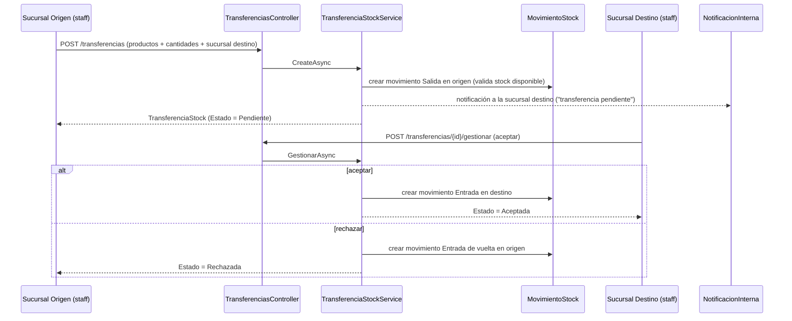

# Módulo: Sucursales

## Propósito

Vuelve a SIGA un sistema **multi-sucursal**: casi todo lo transaccional (stock, ventas, caja, timbrado, compras/recepciones, egresos, turnos/agenda, consultas clínicas) queda scopeado por sucursal, con transferencias de stock entre sucursales con flujo de aprobación. Es un proyecto transversal que tocó prácticamente todos los demás módulos del sistema, no solo las entidades propias listadas abajo.

## Entidades principales

| Entidad | Rol |
|---|---|
| `Sucursal` | Unidad de scoping — nombre, código único, ubicación (`Ciudad`) |
| `TransferenciaStock` | Cabecera de una transferencia entre dos sucursales (origen, destino, estado) |
| `TransferenciaStockItem` | Líneas de la transferencia (producto, cantidad) |
| `Ciudad` / `Departamento` | Catálogo de ubicación geográfica de Paraguay, reutilizado por `Sucursal` y `Proveedor` |

Además, `SucursalId` (FK) fue agregado a ~15 entidades transaccionales ya documentadas en `../schema.md` (Grupos A, B y C): `User`, `HorarioProfesional`, `ConsultaClinica`, `Turno`, `MovimientoStock`, `StockLote`, `ConteoInventario`, `Venta`, `Timbrado`, `PedidoProveedor`, `RecepcionMercaderia`, `Egreso` (y sus subtipos vía TPH), `SesionCaja`, `MovimientoCaja`. Quedan explícitamente **globales** (sin `SucursalId`): catálogos (`Producto`, `Marca`, `Servicio`, etc.) y personas (`Patient`, `Cliente`, `Professional`, y el `User` del admin).

## Reglas de negocio clave

- **Una sucursal fija por usuario, sin selector** — ver [ADR 0009](../adr/0009-sucursal-fija-por-usuario.md). `User.SucursalId = null` significa usuario global (admin, y todos los pacientes por diseño). El scoping se resuelve centralmente en `ICurrentUserContext` (`UserId`/`SucursalId`/`EsGlobal`/`TienePermiso`), no repetido en cada servicio.
- **La sucursal del staff se asigna desde el form de Profesional o de Empleado**, no desde la pantalla de Usuarios (esa solo gestiona roles + activar/desactivar).
- **Pacientes son globales**: no pertenecen a una sucursal fija, la eligen al reservar cada turno (paso propio en el modal de reserva).
- **`ProductoStockConfig` (mín/máx de stock) quedó global por producto**, no por sucursal — desvío de diseño explícito para no romper la relación 1:1 durante la migración; mín/máx por sucursal queda como refinamiento futuro.
- **`TrabajoPedido` no tiene `SucursalId` propio** — deriva de `Venta.SucursalId` (el `LaboratorioService` scopea a través de esa relación).
- **Transferencias de stock con flujo de aprobación**: crear = `Salida` en origen (estado `Pendiente`); aceptar = `Entrada` en destino; rechazar = `Entrada` de vuelta al origen. **Solo la sucursal destino gestiona** la aceptación o el rechazo — la sucursal origen no puede cancelar unilateralmente una vez creada.
- **Usuario global (admin) ve y filtra todas las sucursales**; el resto del staff solo ve/opera la propia.

## Endpoints

| Método | Ruta | Descripción |
|---|---|---|
| GET | /api/sucursales?soloActivas | Listado — abierto a cualquier autenticado (incl. pacientes, lo necesitan para reservar turno) |
| GET | /api/sucursales/{id} | Detalle |
| POST / PUT / DELETE | /api/sucursales(/{id}) | ABM, policy `gestionar_sucursales` |
| GET | /api/transferencias?estado | Listado, policy `transferir_stock` |
| POST | /api/transferencias | Crear (Salida en origen, `Pendiente`), policy `transferir_stock` |
| POST | /api/transferencias/{id}/gestionar | Aceptar/rechazar, policy `transferir_stock` |

Ver `../api-reference.md` § 12.

## Flujo típico

Transferencia de stock entre dos sucursales:

## Vistas de frontend

- `SucursalesView.vue` — ABM de sucursales (`/admin/sucursales`)
- `TransferenciasView.vue` — crear transferencia (búsqueda de productos) + gestionar entrantes (aceptar/rechazar), ruta `/stock/transferencias`
- Badge de sucursal en `AppHeader.vue` (componente, no vista): visible solo si el usuario tiene sucursal asignada (staff) o el permiso `ver_todas_sucursales` (admin → muestra "Todas")
- Paso de selección de sucursal en el modal de reserva de turno de `MisTurnosView.vue` (portal del paciente)

## Estado

✅ **Las 7 fases del proyecto (0 a 6) están completas en código**: Fase 0 (entidad Sucursal + CRUD + JWT + `ICurrentUserContext` + permisos), Fase 1 (stock por sucursal), Fase 2 (ventas+caja+timbrado por sucursal), Fase 3 (compras+egresos por sucursal), Fase 4 (turnos/agenda+clínica por sucursal), Fase 5 (transferencias de stock), Fase 6 (reportes por sucursal). Migraciones `047` a `052`. `dotnet build`/`vue-tsc`/`vite build` en verde según memoria de proyecto.

**Corrección de estado importante (verificado con `git log`/`git status` el 2026-07-08):** la memoria de proyecto y una nota dejada en `../architecture.md` durante la Fase 1 de esta documentación decían que "nada estaba commiteado" al proyecto. Verificado ahora contra el repo real: **sí está commiteado y pusheado** — la rama `matias-gaona` está al día con `origin` y el historial incluye, entre otros, `b289615 "Integracion inicial de sucursales de forma global, ajustes en ventas, compras, stock, turnos entre otros."` y `6d4a72b "Asignar sucursal a empleados y profesionales; pacientes globales"`. La información de "no commiteado" quedó desactualizada — recomendado corregir `../architecture.md` § Multi-sucursal y la memoria de proyecto (`project_sucursales.md`) para que no sigan afirmando lo contrario.

⚠️ **Refinamientos futuros identificados, no implementados:** mín/máx de stock por sucursal (hoy global), selector cross-sucursal para el admin en algunos listados (productos/stock), selector de sucursal en el form de horarios para profesionales multi-sucursal.
