# Esquema de Base de Datos — SIGA Óptica

## Leyenda de estado
- ✅ Implementada
- 🔜 Planificada

---

## Diagrama ERD

```mermaid
erDiagram

    %% ─────────────────────────────────────────
    %% MÓDULO: IDENTIDAD Y ACCESO ✅
    %% ─────────────────────────────────────────

    persons {
        int     id           PK
        varchar ci           UK  "único por persona"
        varchar first_name
        varchar last_name
        date    birth_date
        varchar phone_number
        varchar email        UK  "único, usado para login"
        timestamp created_at
        timestamp updated_at
    }

    users {
        int     id           PK
        int     person_id    FK  "1:1 con persons"
        varchar password_hash
        bool    is_active
        timestamp created_at
        timestamp updated_at
    }

    roles {
        int     id           PK
        varchar name         UK
        text[]  permissions      "array de strings: ver_pacientes, crear_rol, etc."
    }

    user_roles {
        int user_id          FK
        int role_id          FK
    }

    %% ─────────────────────────────────────────
    %% MÓDULO: PROFESIONALES Y PACIENTES ✅
    %% ─────────────────────────────────────────

    professionals {
        int     id           PK
        int     user_id      FK  "1:1 con users"
        varchar specialty
        varchar license_number
        timestamp created_at
        timestamp updated_at
    }

    patients {
        int     id           PK
        int     person_id    FK  "1:1 con persons"
        int     user_id      FK  "nullable — solo si tiene cuenta"
        bool    is_active
        timestamp created_at
        timestamp updated_at
    }

    %% ─────────────────────────────────────────
    %% MÓDULO: AGENDA 🔜
    %% ─────────────────────────────────────────

    appointments {
        int     id              PK
        int     patient_id      FK
        int     professional_id FK
        timestamp scheduled_at
        int     duration_minutes    "default 30"
        varchar status              "pendiente | confirmado | completado | cancelado | no_asistio"
        text    notes
        timestamp created_at
        timestamp updated_at
    }

    %% ─────────────────────────────────────────
    %% MÓDULO: CLÍNICA / HISTORIA CLÍNICA 🔜
    %% ─────────────────────────────────────────

    clinical_records {
        int     id              PK
        int     patient_id      FK
        int     professional_id FK
        int     appointment_id  FK  "nullable — puede registrarse sin cita"
        date    visit_date
        text    chief_complaint     "motivo de consulta"
        text    notes
        timestamp created_at
        timestamp updated_at
    }

    prescriptions {
        int     id                  PK
        int     clinical_record_id  FK  "1:1 con clinical_records"
        decimal sphere_od               "esfera ojo derecho"
        decimal cylinder_od             "cilindro ojo derecho"
        int     axis_od                 "eje ojo derecho 0-180"
        decimal add_od                  "adición (bifocal/progresivo)"
        decimal sphere_os               "esfera ojo izquierdo"
        decimal cylinder_os
        int     axis_os
        decimal add_os
        decimal pupillary_distance_near
        decimal pupillary_distance_far
        varchar lens_type               "monofocal | bifocal | progresivo | ocupacional"
        text    notes
        timestamp created_at
    }

    %% ─────────────────────────────────────────
    %% MÓDULO: INVENTARIO 🔜
    %% ─────────────────────────────────────────

    product_categories {
        int     id    PK
        varchar name  UK  "Marcos | Lentes de Contacto | Soluciones | Accesorios"
        varchar icon
    }

    products {
        int     id          PK
        int     category_id FK
        varchar name
        varchar sku         UK
        varchar brand
        varchar description
        decimal price
        int     stock
        int     stock_min       "alerta de stock bajo"
        bool    is_active
        timestamp created_at
        timestamp updated_at
    }

    %% ─────────────────────────────────────────
    %% MÓDULO: VENTAS 🔜
    %% ─────────────────────────────────────────

    sales {
        int     id              PK
        int     patient_id      FK  "nullable — venta sin paciente registrado"
        int     user_id         FK  "quién registró la venta"
        int     prescription_id FK  "nullable — venta vinculada a receta"
        timestamp sale_date
        decimal subtotal
        decimal discount
        decimal total
        varchar payment_method      "efectivo | tarjeta | transferencia"
        varchar status              "pendiente | pagado | anulado"
        text    notes
        timestamp created_at
        timestamp updated_at
    }

    sale_items {
        int     id          PK
        int     sale_id     FK
        int     product_id  FK
        int     quantity
        decimal unit_price      "precio al momento de la venta"
        decimal discount
        decimal subtotal
    }

    %% ─────────────────────────────────────────
    %% RELACIONES
    %% ─────────────────────────────────────────

    persons          ||--o| users           : "1:1"
    persons          ||--o| patients        : "1:1"
    users            ||--|{ user_roles      : ""
    roles            ||--|{ user_roles      : ""
    users            ||--o| professionals   : "1:1"
    users            ||--o| patients        : "cuenta opcional"
    patients         ||--o{ appointments    : ""
    professionals    ||--o{ appointments    : ""
    patients         ||--o{ clinical_records : ""
    professionals    ||--o{ clinical_records : ""
    appointments     ||--o| clinical_records : "opcional"
    clinical_records ||--o| prescriptions   : "1:1"
    product_categories ||--|{ products      : ""
    patients         ||--o{ sales           : ""
    users            ||--|{ sales           : ""
    prescriptions    ||--o{ sales           : ""
    sales            ||--|{ sale_items      : ""
    products         ||--|{ sale_items      : ""
```

---

## Notas de diseño

### Paciente sin cuenta de usuario
`patients.user_id` es nullable. Un paciente puede ser registrado por recepción sin que tenga acceso al sistema.

### Venta sin paciente registrado
`sales.patient_id` es nullable para contemplar ventas rápidas (mostrador) sin asociar a un paciente.

### Receta vinculada a venta
`sales.prescription_id` permite asociar una venta de lentes a la receta que la originó, facilitando trazabilidad clínica.

### Historial clínico sin cita previa
`clinical_records.appointment_id` es nullable para registrar consultas de urgencia o espontáneas.

### Permisos por módulo
| Módulo        | Permisos sugeridos                                                   |
|---------------|----------------------------------------------------------------------|
| Pacientes     | `ver_pacientes` `crear_paciente` `editar_paciente` `desactivar_paciente` |
| Profesionales | `ver_profesionales` `crear_profesional` `editar_profesional` `desactivar_profesional` |
| Agenda        | `ver_agenda` `crear_cita` `editar_cita` `cancelar_cita`              |
| Clínica       | `ver_historia_clinica` `crear_consulta` `editar_consulta`            |
| Inventario    | `ver_inventario` `crear_producto` `editar_producto` `eliminar_producto` |
| Ventas        | `ver_ventas` `crear_venta` `anular_venta`                            |
| Usuarios      | `ver_usuarios` `editar_usuario`                                      |
| Roles         | `crear_rol` `editar_rol` `eliminar_rol`                              |
