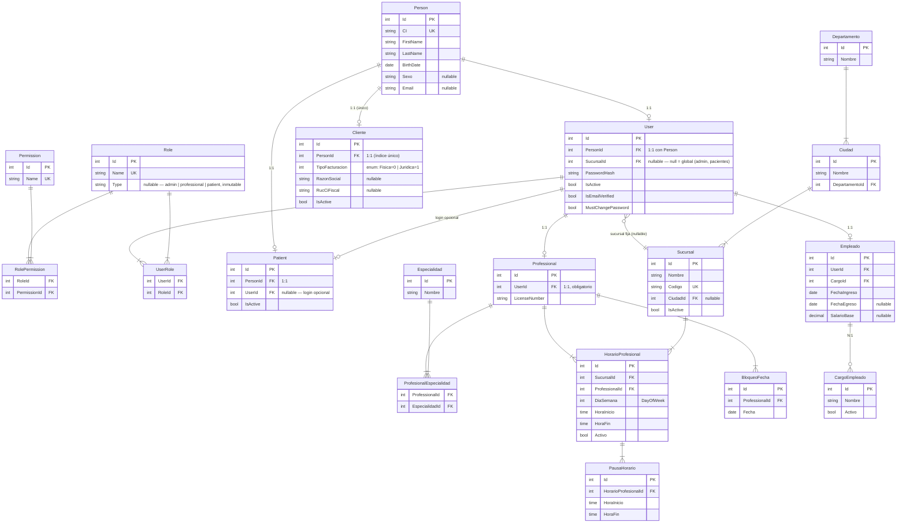

# Esquema de Base de Datos — SIGA Óptica

> Reescrito completo el 2026-07-08 (conteos re-verificados 2026-07-09) a partir de las 69 clases de entidad reales en `SIGA.Domain/Entities` (más 22 enums de negocio — 91 tipos en 87 archivos) y las convenciones Fluent API en `SIGA.Infrastructure/Persistence/Configurations`. La versión anterior de este documento describía ~13 tablas de una versión muy temprana del sistema y está completamente obsoleta.

## Cómo leer este documento

- Los diagramas usan el **nombre de la clase C#** (PascalCase) como identificador de entidad, no el nombre físico de la tabla. Postgres usa snake_case (confirmado explícitamente vía `builder.ToTable("...")` para varias entidades — ej. `Egreso`→`egresos`, `Cliente`→`clientes`, `Venta`→`ventas`, `TrabajoPedido`→`trabajos_pedido`); para el resto, asumir la misma convención pero confirmar contra el `*Configuration.cs` puntual antes de escribir SQL a mano.
- Los diagramas Mermaid muestran **PK, FK y los campos de negocio más relevantes** — no todos los campos. El detalle completo de cada entidad está en la lista de "Diccionario de datos" que sigue a cada diagrama.
- Convención transversal no repetida en cada entidad: la gran mayoría de las entidades tienen `CreatedAt` (`DateTime`) y muchas `UpdatedAt`; varias tienen `IsActive`/`Activo` (bool) para borrado lógico. Solo se listan explícitamente cuando su ausencia o comportamiento es relevante.
- El esquema físico es **uno solo**; se divide en 3 diagramas únicamente por legibilidad (69 entidades en un solo ER es ilegible), no porque sean bases de datos separadas. Las FKs que cruzan de un grupo a otro se anotan igual.

---

## Grupo A — Identidad, Personas y Personal

Todo lo relacionado a "quién es quién" en el sistema: autenticación, roles/permisos, y los distintos roles funcionales que puede tener una `Person` (paciente, profesional, cliente, empleado), más ubicaciones y sucursales.

```mermaid
erDiagram
    Person {
        int Id PK
        string CI UK
        string FirstName
        string LastName
        date BirthDate
        string Sexo "nullable"
        string Email "nullable"
    }
    User {
        int Id PK
        int PersonId FK "1:1 con Person"
        int SucursalId FK "nullable — null = global (admin, pacientes)"
        string PasswordHash
        bool IsActive
        bool IsEmailVerified
        bool MustChangePassword
    }
    Role {
        int Id PK
        string Name UK
        string Type "nullable — admin | professional | patient, inmutable"
    }
    Permission {
        int Id PK
        string Name UK
    }
    RolePermission {
        int RoleId FK
        int PermissionId FK
    }
    UserRole {
        int UserId FK
        int RoleId FK
    }
    Patient {
        int Id PK
        int PersonId FK "1:1"
        int UserId FK "nullable — login opcional"
        bool IsActive
    }
    Professional {
        int Id PK
        int UserId FK "1:1, obligatorio"
        string LicenseNumber
    }
    Especialidad {
        int Id PK
        string Nombre
    }
    ProfesionalEspecialidad {
        int ProfessionalId FK
        int EspecialidadId FK
    }
    HorarioProfesional {
        int Id PK
        int SucursalId FK
        int ProfessionalId FK
        int DiaSemana "DayOfWeek"
        time HoraInicio
        time HoraFin
        bool Activo
    }
    PausaHorario {
        int Id PK
        int HorarioProfesionalId FK
        time HoraInicio
        time HoraFin
    }
    BloqueoFecha {
        int Id PK
        int ProfessionalId FK
        date Fecha
    }
    Cliente {
        int Id PK
        int PersonId FK "1:1 (índice único)"
        int TipoFacturacion "enum: Fisica=0 | Juridica=1"
        string RazonSocial "nullable"
        string RucCiFiscal "nullable"
        bool IsActive
    }
    Empleado {
        int Id PK
        int UserId FK
        int CargoId FK
        date FechaIngreso
        date FechaEgreso "nullable"
        decimal SalarioBase "nullable"
    }
    CargoEmpleado {
        int Id PK
        string Nombre
        bool Activo
    }
    Sucursal {
        int Id PK
        string Nombre
        string Codigo UK
        int CiudadId FK "nullable"
        bool IsActive
    }
    Ciudad {
        int Id PK
        string Nombre
        int DepartamentoId FK
    }
    Departamento {
        int Id PK
        string Nombre
    }

    Person ||--o| User        : "1:1"
    Person ||--o| Patient     : "1:1"
    Person ||--o| Cliente     : "1:1 (único)"
    User   ||--o| Professional: "1:1"
    User   ||--o| Empleado    : "1:1"
    User   ||--o| Patient     : "login opcional"
    User   }o--|| Sucursal    : "sucursal fija (nullable)"
    User   ||--|{ UserRole    : ""
    Role   ||--|{ UserRole    : ""
    Role   ||--|{ RolePermission : ""
    Permission ||--|{ RolePermission : ""
    Professional ||--|{ ProfesionalEspecialidad : ""
    Especialidad ||--|{ ProfesionalEspecialidad : ""
    Professional ||--|{ HorarioProfesional : ""
    Sucursal     ||--|{ HorarioProfesional : ""
    HorarioProfesional ||--|{ PausaHorario : ""
    Professional ||--|{ BloqueoFecha : ""
    Empleado ||--o{ CargoEmpleado : "N:1"
    Ciudad ||--|{ Sucursal : ""
    Departamento ||--|{ Ciudad : ""
```

### Diccionario de datos — Grupo A

**`Person`** — núcleo de identidad. `CI` único, `Email` único y nullable (usado para login vía `User`). Toda persona del sistema (paciente, profesional, cliente, empleado, admin) tiene exactamente un `Person`.

**`User`** — cuenta de acceso. 1:1 con `Person`. `SucursalId` nullable: `null` = usuario global (admin y pacientes); el resto del staff tiene una sucursal fija asignada desde el form de Profesional o de Empleado (no desde `UsuariosView`, que solo gestiona roles + activar/desactivar). `IsEmailVerified`/`EmailVerificationToken` para el flujo de auto-registro de pacientes; `PasswordResetToken`/`MustChangePassword` para el flujo de gestión de contraseñas.

**`Role` / `Permission` / `RolePermission` / `UserRole`** — autorización many-to-many pura. `Role.Type` (`admin`|`professional`|`patient`, nullable) es la única noción de rol "de sistema", usada solo para bootstrap/lookups internos — la autorización de endpoints siempre pasa por permisos individuales, no por `Type` ni por `Role.Name`.

**`Patient`** — marca que una `Person` es paciente. `UserId` nullable: puede existir sin cuenta de acceso (alta por recepción con solo CI/contacto); si más adelante se le da acceso al portal, se setea `UserId`. Es **global** (sin `SucursalId` propio) — elige sucursal al reservar cada turno.

**`Professional`** — siempre requiere `User` (1:1, obligatorio). `LicenseNumber` es la matrícula. **Trampa real (verificado, la entidad no tiene el campo):** `Professional` NO tiene `PersonId` propio — llega a `Person` únicamente atravesando `User` (`Professional.User.PersonId`). Un query que intente `professional.PersonId` directo no compila. La especialidad es many-to-many vía `ProfesionalEspecialidad` (un profesional puede tener más de una).

**`HorarioProfesional` / `PausaHorario` / `BloqueoFecha`** — disponibilidad del profesional para agenda. `HorarioProfesional` es por sucursal (índice único `ProfessionalId+SucursalId+DiaSemana`, según memoria de proyecto — confirmar en `HorarioProfesionalConfiguration.cs` si se documenta este módulo en detalle). `BloqueoFecha` son excepciones puntuales (ej. vacaciones).

**`Cliente`** — **siempre cuelga de `Person`** (FK único `PersonId`). No es una entidad de facturación separada: `TipoFacturacion`+`RazonSocial`+`RucCiFiscal`+`Direccion`/`Email`/`Telefono` son solo el dato de facturación de esa persona como cliente. Un `Cliente` y un `Patient` pueden compartir el mismo `Person` sin relación directa entre sí (se relacionan solo vía `Person`). Ver [ADR 0001 — Person como raíz de identidad](./adr/0001-person-como-raiz-de-identidad.md).

**`Empleado` / `CargoEmpleado`** — capa de RR.HH. sobre `User` (1:1). `SalarioBase` nullable, usado por el módulo de Egresos (`SalarioEmpleado`, ver Grupo C).

**`Sucursal` / `Ciudad` / `Departamento`** — `Sucursal` es la unidad de scoping multi-sucursal (ver `architecture.md`). `Ciudad`/`Departamento` son catálogo de ubicación geográfica de Paraguay, reutilizado por `Sucursal` y `Proveedor` (Grupo C).

---

## Grupo B — Catálogo, Inventario, Clínica y Agenda

Todo lo que no es directamente "plata entrando o saliendo": el catálogo de productos (incl. el catálogo óptico), el stock, la historia clínica y la agenda de turnos.

```mermaid
erDiagram
    CategoriaProducto {
        int Id PK
        string Nombre
        int Tipo "enum: Generico=0 | Armazon=1 | Cristal=2 (OBSOLETO, ver nota)"
        decimal Margen "% usado para derivar PrecioVenta"
        decimal Descuento
        bool IsActive
    }
    Marca {
        int Id PK
        string Nombre
        bool IsActive
    }
    Modelo {
        int Id PK
        string Nombre
        int MarcaId FK
        bool IsActive
    }
    Producto {
        int Id PK
        string Nombre
        string Categoria "string libre, matchea CategoriaProducto.Nombre"
        int CategoriaProductoId FK "nullable"
        int MarcaId FK "nullable"
        int ModeloId FK "nullable"
        string Sku "nullable"
        decimal PrecioCosto
        decimal PrecioVenta "SIEMPRE derivado, ver nota"
        bool IsActive
    }
    ProductoStockConfig {
        int ProductoId PK_FK "1:1"
        int StockMinimo
        int StockMaximo "nullable"
    }
    MovimientoStock {
        int Id PK
        int ProductoId FK
        int SucursalId FK
        string Tipo "Entrada | Salida (string, no enum)"
        int Cantidad
        int MotivoMovimientoId FK "nullable"
        string Estado "Pendiente | Aprobado | Rechazado (string, no enum)"
    }
    MotivoMovimiento {
        int Id PK
        string Nombre
        string Tipo "Entrada | Salida | Ambos"
    }
    StockLote {
        int Id PK
        int ProductoId FK
        int SucursalId FK
        int RecepcionItemId FK
        string Lote
        date FechaVencimiento "nullable"
    }
    ConteoInventario {
        int Id PK
        int SucursalId FK
        string Estado "Pendiente | Aprobado | Rechazado (string)"
    }
    ConteoInventarioLinea {
        int Id PK
        int ConteoId FK
        int ProductoId FK
        int CantidadSistema
        int CantidadFisica
        int Diferencia
    }
    StockActualView {
        int ProductoId "sin PK — vista SQL vw_stock_actual"
        int SucursalId
        int StockActual
    }
    TipoLente {
        int Id PK
        string Nombre
        decimal PrecioBase
        bool IsActive
    }
    Tratamiento {
        int Id PK
        string Nombre
        decimal Precio
        bool IsActive
    }
    Servicio {
        int Id PK
        string Nombre
        decimal Precio
        bool IsActive
    }
    ServicioTarifa {
        int Id PK
        int ServicioId FK
        int ProfessionalId FK "nullable"
        int EspecialidadId FK "nullable"
        decimal Precio
    }
    ConsultaClinica {
        int Id PK
        int SucursalId FK
        int PatientId FK
        int ProfessionalId FK
        int CitaId "nullable, SIN FK — ver nota"
        int EstadoConfigId FK "nullable"
        datetime FechaConsulta
        string Motivo
        string DiagnosticoPrincipal
        bool IsActive
    }
    Receta {
        int Id PK
        int ConsultaClinicaId FK "nullable, 1:1, Cascade"
        int PersonId FK "nullable — receta externa/manual"
        date FechaEmision
        decimal OdEsferico "nullable, + OdCilindro/OdEje/OdAdicion"
        decimal OiEsferico "nullable, + OiCilindro/OiEje/OiAdicion"
    }
    EstadoConfig {
        int Id PK
        string Entidad "Turno | Pedido | Consulta"
        string Nombre
        string Color
        bool EsProtegido
    }
    Turno {
        int Id PK
        int SucursalId FK
        int ProfessionalId FK
        int PatientId FK
        datetime FechaHora
        int Estado "enum TurnoEstado"
        int EstadoCustomId FK "nullable, EstadoConfig"
        bool SolicitudCancelacion
    }
    TransferenciaStock {
        int Id PK
        int SucursalOrigenId FK
        int SucursalDestinoId FK
        date Fecha
        string Estado "Pendiente | Aceptada | Rechazada (string)"
    }
    TransferenciaStockItem {
        int Id PK
        int TransferenciaStockId FK
        int ProductoId FK
        int Cantidad
    }

    CategoriaProducto ||--o{ Producto : ""
    Marca ||--o{ Modelo : ""
    Marca ||--o{ Producto : ""
    Modelo ||--o{ Producto : ""
    Producto ||--o| ProductoStockConfig : "1:1 (global, no por sucursal)"
    Producto ||--|{ MovimientoStock : ""
    MotivoMovimiento ||--o{ MovimientoStock : ""
    Producto ||--|{ StockLote : ""
    Producto ||--|{ ConteoInventarioLinea : ""
    ConteoInventario ||--|{ ConteoInventarioLinea : ""
    Servicio ||--|{ ServicioTarifa : ""
    Patient ||--|{ ConsultaClinica : ""
    Professional ||--|{ ConsultaClinica : ""
    ConsultaClinica ||--o| Receta : "1:1 opcional"
    Person ||--o{ Receta : "receta externa/manual"
    Professional ||--|{ Turno : ""
    Patient ||--|{ Turno : ""
    EstadoConfig ||--o{ Turno : "estado cosmético"
    Sucursal ||--|{ TransferenciaStock : "origen/destino"
    TransferenciaStock ||--|{ TransferenciaStockItem : ""
    Producto ||--|{ TransferenciaStockItem : ""
```

### Diccionario de datos — Grupo B

**Catálogo óptico — nota importante (verificado contra código, no solo memoria):** `CategoriaProducto.Tipo = Cristal` está marcado **`[Obsoleto]`** en el propio código (`TipoCategoriaProducto.cs`): *"Los cristales/lentes graduados ya no se modelan como producto con stock; son una especificación del trabajo a pedido"*. Esto es una decisión **más reciente** que lo que registraba la memoria de proyecto (que aún describía `TrabajoPedido.CristalProductoId` como FK a `Productos`). En el código actual, `TrabajoPedido` **no tiene** `CristalProductoId` — el cristal se resuelve como `TipoLente` (clasificación) + `Tratamiento`s (colección many-to-many) dentro del propio `TrabajoPedido`, y en `VentaLinea` existe `TipoLineaVenta.Lente = 2` ("lente graduado hecho a pedido, no descuenta stock"). Documentar esto correctamente en `modules/08-ventas.md` y `modules/09-laboratorio.md` cuando se escriban (Fase 4) — no repetir la versión vieja de la memoria.

**`Producto`** — `PrecioVenta` **siempre se deriva** de `PrecioCosto × (1 + CategoriaProducto.Margen/100)`, nunca se carga a mano (centralizado en `Producto.AplicarCosto`). `Categoria` (string) es un campo legado que matchea `CategoriaProducto.Nombre` por texto — el FK real `CategoriaProductoId` existe pero conviven ambos. `Color`/`Talle` para variantes simples de armazón.

**`ProductoStockConfig`** — mín/máx de stock, 1:1 con `Producto`, **global** (no por sucursal) — decisión de diseño explícita para no romper la relación 1:1 durante la migración multi-sucursal; mín/máx por sucursal queda como refinamiento futuro.

**`MovimientoStock` / `StockActualView`** — el stock **no es un campo** de `Producto`; se deriva sumando `MovimientoStock` (`Entrada`+, `Salida`−) filtrados por `Estado = "Aprobado"`. `vw_stock_actual` (mapeada por `StockActualView`, `HasNoKey()+ToView`) es una vista SQL que calcula el stock actual agrupando por `Producto`+`Sucursal`. **Nota de consistencia:** `MovimientoStock.Tipo`/`.Estado`, `ConteoInventario.Estado` y `TransferenciaStock.Estado` usan **strings libres** ("Pendiente"/"Aprobado"/"Rechazado", etc.) en vez de un enum C#, a diferencia de módulos más nuevos (`Venta.Estado`, `TrabajoPedido.Estado`, `PedidoProveedor.Estado`, `Egreso.Estado` sí son enums reales) — inconsistencia de convención entre módulos de distinta antigüedad, no un bug.

**`StockLote` / `ConteoInventario`** — trazabilidad de lotes con vencimiento (originados en una recepción de mercadería) y conteos físicos periódicos con diferencia sistema-vs-físico por sucursal.

**`ConsultaClinica`** — `CitaId` es un `int?` **sin FK** — nota histórica: se dejó así porque en su momento la Agenda no estaba implementada; a la fecha de este documento la Agenda (`Turno`) sí existe, así que este campo debería revisarse (posible deuda técnica: o se vincula formalmente con FK, o se documenta por qué se mantiene desacoplado). `EstadoConfigId` es un estado cosmético configurable (tabla `EstadoConfig`, compartida con `Turno`/`PedidoProveedor` vía el campo `Entidad`).

**`Receta`** — puede originarse en una `ConsultaClinica` (1:1, `Cascade`) **o** cargarse manualmente para una `Person` sin consulta previa (`PersonId`, receta "externa" — ej. el cliente trae una receta de otra óptica). Ambos FKs son nullable; `EsExterna` en el DTO de respuesta se deriva de si `ConsultaClinicaId` es null.

**`Turno`** — `Estado` es el enum real (`TurnoEstado`: Pendiente/Completado/Cancelado/Confirmado/Presente) que gobierna la lógica; `EstadoCustomId` (FK a `EstadoConfig`) es puramente cosmético/configurable por el negocio (color, nombre visible), no reemplaza al enum.

**`TransferenciaStock` / `TransferenciaStockItem`** — transferencia de stock entre dos sucursales con flujo de aprobación: crear = `Salida` en origen (estado `Pendiente`); aceptar = `Entrada` en destino; rechazar = `Entrada` de vuelta al origen. Solo la sucursal destino gestiona la aceptación/rechazo.

---

## Grupo C — Comercial: Ventas, Laboratorio, Compras, Caja y Egresos

Todo lo que mueve dinero o compromisos comerciales.

```mermaid
erDiagram
    Venta {
        int Id PK
        string NumeroComprobante
        int SucursalId FK
        int ClienteId FK "nullable = Consumidor Final"
        int VendedorId FK "nullable"
        int RecetaId FK "nullable, SetNull"
        int Estado "enum EstadoVenta"
        int Tipo "enum TipoVenta: Directa=1 | TrabajoAPedido=2"
        int CondicionVenta "enum: Contado=0 | Credito=1"
        date FechaVenta
        int ValidezDias "default 15 (presupuesto)"
    }
    VentaLinea {
        int Id PK
        int VentaId FK
        int Tipo "enum TipoLineaVenta: Producto=0 | Servicio=1 | Lente=2"
        int ProductoId FK "nullable"
        int ServicioId FK "nullable"
        int Cantidad
        decimal PrecioUnitario
        int CategoriaFiscal "enum: Exento=0 | Gravado5=1 | Gravado10=2"
    }
    Cobro {
        int Id PK
        int VentaId FK
        int Tipo "enum TipoCobro: Seña=1 | Cuota=2"
        decimal MontoTotal
        bool Anulado
        int RegistradoPorId FK
    }
    CobroLinea {
        int Id PK
        int CobroId FK
        int MetodoPago "enum: Efectivo | Tarjeta | Transferencia | Cheque"
        decimal Monto
    }
    FacturaVenta {
        int Id PK
        int VentaId FK "1:1, Cascade"
        string NumeroFactura
        int TimbradoId FK "nullable"
        decimal MontoExento
        decimal MontoGravado5
        decimal MontoGravado10
    }
    Comprobante {
        int Id PK
        int VentaId FK "1:1, Cascade"
        int Tipo "enum TipoComprobante: ReciboSimple=1"
        int Estado "enum EstadoComprobante: Emitido=1 | Anulado=2"
        int EmitidoPorId FK
    }
    Timbrado {
        int Id PK
        int SucursalId FK
        string NumeroTimbrado
        int UltimoNumero
        date FechaInicioVigencia
        date FechaFinVigencia
    }
    Devolucion {
        int Id PK
        int VentaId FK
        int Tipo "enum TipoDevolucion: Devolucion=1 | Cambio=2"
        int Estado "enum EstadoDevolucion: Pendiente=1 | Confirmada=2 | Rechazada=3"
        int SolicitadoPorId FK
        int ConfirmadoPorId FK "nullable"
    }
    DevolucionLinea {
        int Id PK
        int DevolucionId FK
        int ProductoDevueltoId FK
        int CantidadDevuelta
        int ProductoNuevoId FK "nullable — cambio"
        int CantidadNueva "nullable"
    }
    TrabajoPedido {
        int Id PK
        int VentaId FK "1:1 único"
        int RecetaId FK "nullable, SetNull"
        int TipoLenteId FK "nullable"
        int ArmazonProductoId FK "nullable, SetNull"
        bool ArmazonDelCliente
        int LaboratorioProveedorId FK "nullable — Proveedor con EsLaboratorio=true"
        int Estado "enum EstadoTrabajoPedido"
        int MedioEnvio "enum MedioEnvioLaboratorio, nullable"
        int AprobadoPorId FK "nullable"
    }
    FacturaLaboratorio {
        int Id PK
        int TrabajoPedidoId FK "1:1, Cascade"
        string NumeroFactura
        decimal Monto
        int EmitidoPorId FK
    }
    Proveedor {
        int Id PK
        string Nombre
        string Ruc
        int CiudadId FK "nullable"
        bool EsLaboratorio
        bool IsActive
    }
    ProveedorContacto {
        int Id PK
        int ProveedorId FK
        string Nombre
    }
    PedidoProveedor {
        int Id PK
        int SucursalId FK
        int ProveedorId FK
        int Estado "enum EstadoPedido"
        date FechaOrden "nullable"
    }
    PedidoProveedorItem {
        int Id PK
        int PedidoProveedorId FK
        int ProductoId FK
        int Cantidad
        int CantidadRecibida
        decimal PrecioUnitario
    }
    RecepcionMercaderia {
        int Id PK
        int SucursalId FK
        int PedidoProveedorId FK
        int FacturaCompraId FK "nullable"
        date FechaRecepcion
        int UserId FK
    }
    RecepcionMercaderiaItem {
        int Id PK
        int RecepcionId FK
        int PedidoItemId FK
        int Cantidad
        string Lote "nullable"
    }
    DevolucionProveedor {
        int Id PK
        int PedidoProveedorId FK
        int PedidoProveedorItemId FK
        int Cantidad
        string Motivo
    }
    Egreso {
        int Id PK
        int SucursalId FK
        int RegistradoPorId FK "nullable"
        int Tipo "enum TipoEgreso — discriminador TPH"
        int Estado "enum EstadoEgreso"
        decimal Monto
        string Concepto
        date FechaEmision
        date FechaVencimiento "nullable"
        date FechaPago "nullable"
        int MetodoPago "enum, nullable"
        bool PagoExterno
    }
    FacturaCompra {
        int ProveedorId FK
        int PedidoProveedorId FK "nullable"
        string NroFactura "nullable"
        int CondicionVenta "enum"
    }
    FacturaCompraItem {
        int Id PK
        int FacturaCompraId FK
        int ProductoId FK "nullable"
        int Cantidad
        decimal PrecioUnitario
        int TipoIva "enum TipoIvaFactura"
    }
    Honorario {
        int ProfessionalId FK
        string Periodo "nullable"
    }
    GastoGeneral {
        int CategoriaGastoId FK
    }
    CategoriaGasto {
        int Id PK
        string Nombre
        bool Activo
    }
    SalarioEmpleado {
        int EmpleadoId FK
        string Periodo "nullable"
    }
    EgresoFacturaLaboratorio {
        int FacturaLaboratorioId FK
    }
    MovimientoCaja {
        int Id PK
        int SucursalId FK
        int Tipo "enum TipoMovimientoCaja: Ingreso=0 | Egreso=1"
        decimal Monto
        int MetodoPago "enum"
        int VentaId FK "nullable"
        int EgresoId FK "nullable"
        int SesionCajaId FK "nullable"
    }
    SesionCaja {
        int Id PK
        int SucursalId FK
        int Estado "enum EstadoSesionCaja: Abierta | Cerrada | PendienteAprobacion"
        decimal MontoInicial
        int AbiertaPorId FK
        decimal EfectivoContado "nullable"
        decimal EfectivoEsperado "nullable"
        decimal Diferencia "nullable"
    }

    Venta ||--|{ VentaLinea : ""
    Venta ||--o{ Cobro : ""
    Cobro ||--|{ CobroLinea : ""
    Venta ||--o| FacturaVenta : "1:1"
    Venta ||--o| Comprobante : "1:1"
    Venta ||--o| TrabajoPedido : "1:1 (solo TipoVenta.TrabajoAPedido)"
    Venta ||--o{ Devolucion : ""
    Devolucion ||--|{ DevolucionLinea : ""
    Timbrado ||--o{ FacturaVenta : ""
    TrabajoPedido ||--o| FacturaLaboratorio : "1:1"
    Proveedor ||--o{ TrabajoPedido : "laboratorio externo"
    Proveedor ||--|{ PedidoProveedor : ""
    Proveedor ||--|{ ProveedorContacto : ""
    PedidoProveedor ||--|{ PedidoProveedorItem : ""
    PedidoProveedor ||--o{ RecepcionMercaderia : ""
    PedidoProveedor ||--o{ DevolucionProveedor : ""
    RecepcionMercaderia ||--|{ RecepcionMercaderiaItem : ""
    RecepcionMercaderia ||--o| FacturaCompra : "opcional"
    Egreso ||--o| FacturaCompra : "TPH: discriminador Tipo"
    Egreso ||--o| Honorario : "TPH"
    Egreso ||--o| GastoGeneral : "TPH"
    Egreso ||--o| SalarioEmpleado : "TPH"
    Egreso ||--o| EgresoFacturaLaboratorio : "TPH"
    FacturaCompra ||--|{ FacturaCompraItem : ""
    CategoriaGasto ||--o{ GastoGeneral : ""
    SesionCaja ||--o{ MovimientoCaja : ""
    Venta ||--o{ MovimientoCaja : "ingreso de contado"
    Egreso ||--o{ MovimientoCaja : "pago"
```

### Diccionario de datos — Grupo C

**`Venta`** — cabecera única para venta directa y presupuesto/venta a pedido (`Tipo`). `ClienteId` nullable = "Consumidor Final". `Estado` (`EstadoVenta`: Borrador→Confirmada→EnProceso→ListaParaCobrar→ComprobanteEmitido, o Cancelada en cualquier punto) — nota: `EnProceso` quedó **sin uso** para ventas nuevas desde el fix de "cobro desacoplado del laboratorio" (toda venta confirmada, directa o a pedido, pasa directo a `ListaParaCobrar`; el ciclo del laboratorio corre en paralelo sin bloquear el cobro). Varios totales (`MontoExento`, `MontoGravado5/10`, `Total`, `MontoSeña`, `TotalCobrado`, `SaldoPendiente`) están **`Ignore()`d por EF** — son propiedades calculadas en memoria, no columnas.

**`VentaLinea`** — `Tipo = Lente` es la línea de un cristal graduado a pedido (no descuenta stock, ver nota del Grupo B). `CategoriaFiscal` por línea permite mezclar ítems con distinto tratamiento de IVA paraguayo en la misma venta.

**`Cobro` / `CobroLinea`** — un `Cobro` puede tener múltiples `CobroLinea` (métodos de pago combinados, ej. parte efectivo + parte tarjeta). `Tipo` distingue seña (venta a crédito, primer pago) de cuota (pagos siguientes).

**`FacturaVenta` / `Comprobante`** — dos documentos de venta distintos, ambos 1:1 con `Venta` (`Cascade` al borrar la venta). `Comprobante` es el recibo simple interno; `FacturaVenta` es la factura fiscal formal, ligada a un `Timbrado` vigente de la sucursal.

**`TrabajoPedido`** — el núcleo del flujo "óptica a pedido". `Estado` incluye `Borrador` (=5, agregado después, sin renumerar los demás) para la config óptica de un presupuesto aún no confirmado — **no entra a la cola del laboratorio** hasta que la venta se confirma y (si el TP sigue en Borrador) se le asigna laboratorio, pasando a `PendienteAprobacion`. `ArmazonDelCliente=true` permite un trabajo sin `ArmazonProductoId` (el cliente trae su propio armazón). Ver nota del Grupo B sobre la obsolescencia de `CristalProductoId`.

**`Proveedor.EsLaboratorio`** — el mismo catálogo de proveedores sirve tanto para compras de mercadería como para laboratorios ópticos externos; `TrabajoPedido.LaboratorioProveedorId` filtra por este flag.

**`PedidoProveedor` → `RecepcionMercaderia` → `FacturaCompra`** — ciclo de compras: se crea la OC (`PedidoProveedor`, estado `Borrador`→`Confirmada`→`RecibidaParcial`/`RecibidaTotal`→`Facturada`, o `Cancelada`), se registran una o más recepciones parciales (`RecepcionMercaderia`, cada una con sus `RecepcionMercaderiaItem` que pueden generar `StockLote`), y opcionalmente se registra la factura del proveedor (`FacturaCompra`, ligada o no a la OC vía `PedidoProveedorId` nullable).

**`Egreso` — herencia TPH (Table-Per-Hierarchy):** `Egreso` es la clase base abstracta de todo lo que representa una salida de dinero, mapeada a una **única tabla física `egresos`** con columna discriminadora `Tipo` (`TipoEgreso` enum). Los 5 subtipos (`FacturaCompra`, `Honorario`, `GastoGeneral`, `SalarioEmpleado`, `EgresoFacturaLaboratorio`) solo agregan 1-3 columnas específicas (ej. `Honorario.ProfessionalId`, `SalarioEmpleado.EmpleadoId`) y comparten todo el resto (`Monto`, `Estado`, `FechaEmision`, `MetodoPago`, `PagoExterno`, etc.) de la base. Esto explica por qué `FacturaCompra : Egreso` no es un error de modelado — una factura de compra a proveedor **es** (no "tiene") un egreso.

**`MovimientoCaja` / `SesionCaja`** — `SesionCaja` es "una caja abierta por sucursal a la vez" (apertura con `MontoInicial`, cierre con conteo físico `EfectivoContado` vs. `EfectivoEsperado` y `Diferencia`, con flujo de aprobación si hay diferencia — `EstadoSesionCaja.PendienteAprobacion`). Cada `MovimientoCaja` puede originarse en una `Venta` (cobro), un `Egreso` (pago) o ser manual, y siempre pertenece a una `SesionCaja`.

---

## Entidades transversales

**`ConfiguracionNegocio`** — fila única (singleton lógico) con los datos fiscales/de contacto del negocio (`NombreFantasia`, `RazonSocial`, `CUIT`, etc.), usada por generación de PDFs y comprobantes. Sin FKs.

**`NotificacionInterna`** — centro de notificaciones internas al staff. Destinatario por `DestinatarioUsuarioId` (individual, nullable), `DestinatarioSucursalId` (broadcast a staff de esa sucursal, nullable) o ambos null (broadcast global). `EntidadOrigenTipo`/`EntidadOrigenId` referencian polimórficamente la entidad que disparó la notificación (sin FK real — es una referencia débil por diseño). `Leido` es un único flag compartido para notificaciones de broadcast, no por-usuario (decisión explícita).

---

## Tabla de enums

| Enum | Valores | Usado en |
|---|---|---|
| `EstadoVenta` | Borrador=1, Confirmada=2, EnProceso=3 *(sin uso en ventas nuevas)*, ListaParaCobrar=4, ComprobanteEmitido=5, Cancelada=6 | `Venta.Estado` |
| `TipoVenta` | Directa=1, TrabajoAPedido=2 | `Venta.Tipo` |
| `CondicionVenta` | Contado=0, Credito=1 | `Venta.CondicionVenta`, `FacturaCompra.CondicionVenta` |
| `TipoLineaVenta` | Producto=0, Servicio=1, Lente=2 | `VentaLinea.Tipo` |
| `CategoriaFiscal` | Exento=0, Gravado5=1, Gravado10=2 | `VentaLinea.CategoriaFiscal` |
| `TipoCobro` | Seña=1, Cuota=2 | `Cobro.Tipo` |
| `MetodoPago` | Efectivo=0, Tarjeta=1, Transferencia=2, Cheque=3 | `CobroLinea`, `MovimientoCaja`, `Egreso` |
| `TipoComprobante` / `EstadoComprobante` | ReciboSimple=1 / Emitido=1, Anulado=2 | `Comprobante` |
| `TipoDevolucion` / `EstadoDevolucion` | Devolucion=1,Cambio=2 / Pendiente=1,Confirmada=2,Rechazada=3 | `Devolucion` |
| `EstadoTrabajoPedido` | PendienteAprobacion=0, PendienteEnvio=1, Enviado=2, Recibido=3, Rechazado=4, Borrador=5 | `TrabajoPedido.Estado` |
| `MedioEnvioLaboratorio` | WhatsApp=0, Email=1, Portal=2, Telefono=3, EnPersona=4, Otro=5 | `TrabajoPedido.MedioEnvio` |
| `EstadoPedido` | Borrador=0, Confirmada=1, RecibidaParcial=2, RecibidaTotal=3, Cancelada=4, Facturada=5 | `PedidoProveedor.Estado` |
| `TipoIvaFactura` | (ver `TipoIvaFactura.cs` — incluye `Iva10` como default) | `FacturaCompraItem.TipoIva` |
| `TipoEgreso` | FacturaCompra=0, Honorario=1, GastoGeneral=2, Salario=3, FacturaLaboratorio=4 | `Egreso.Tipo` (discriminador TPH) |
| `EstadoEgreso` | Borrador=0, Pendiente=1, Pagado=2, Anulado=3, Aprobado=4, Rechazado=5 | `Egreso.Estado` |
| `TipoMovimientoCaja` | Ingreso=0, Egreso=1 | `MovimientoCaja.Tipo` |
| `EstadoSesionCaja` | Abierta, Cerrada, PendienteAprobacion | `SesionCaja.Estado` |
| `TurnoEstado` | Pendiente=0, Completado=1, Cancelado=2, Confirmado=3, Presente=4 | `Turno.Estado` |
| `TipoCategoriaProducto` | Generico=0, Armazon=1, **Cristal=2 (obsoleto)** | `CategoriaProducto.Tipo` |
| `TipoFacturacion` | Fisica, Juridica | `Cliente.TipoFacturacion` |

---

## Índices, constraints y convenciones de tipos

Verificado 2026-07-09 contra `Persistence/Configurations/*.cs` directamente (no solo memoria):

- **26 índices únicos** (`HasIndex(...).IsUnique()`) en todo el modelo. Los más relevantes: `persons.CI`, `persons.Email` (con `AreNullsDistinct(true)` — permite múltiples `NULL`), `professionals.LicenseNumber` y `professionals.UserId`, `users.PersonId` y `patients.PersonId`, `timbrados` compuesto (`NumeroTimbrado`, `Establecimiento`, `PuntoExpedicion`), `turnos` (`ProfessionalId`, `FechaHora`), `horarios_profesional` (`ProfessionalId`, `SucursalId`, `DiaSemana`), `bloqueos_fecha` (`ProfessionalId`, `Fecha`), `sucursales.Codigo`, `permissions` (`Entidad`, `Nombre`).
- **FKs con `OnDelete` explícito:** 56 `Restrict` (default defensivo, no deja borrar un padre con hijos), 19 `Cascade` (reservado para hijos de composición: líneas de venta, de pedido, etc.) y 12 `SetNull` (el hijo sobrevive sin el padre). EF autoindexa cada FK.
- **Dinero — siempre `numeric`, nunca `float`/`double`, pero con una inconsistencia real de escala:** 15 columnas `numeric(18,2)` (la mayoría de montos de venta/stock) contra 6 columnas `numeric(18,0)` (Guaraníes sin centavos, en `Empleado`, `Egreso`, `FacturaCompra` y `FacturaCompraItem`). Mezclar ambas escalas en una suma o comparación puede dar redondeos raros en reportes — hay que revisar la escala real de la columna antes de asumir. Porcentajes son `numeric(5,2)` (2 declarados vía `HasColumnType`, 7 vía `HasPrecision(5,2)`); hay un caso suelto `numeric(14,2)` en `Tratamiento`.
- **Fechas/horas:** `DateTime` mapea a `timestamp with time zone` (UTC) en todo el modelo; fechas puras (`BirthDate`, campos `Fecha`) mapean a `date`; horas de disponibilidad a `time`.
- **Auditoría (`CreatedAt`/`UpdatedAt`) se setea en la aplicación** (`DateTime.UtcNow` en la entidad), no hay `DEFAULT now()` ni trigger en la base — un `INSERT`/`UPDATE` por SQL crudo deja esas columnas sin valor.
- **Soft delete (`IsActive`) es manual, sin query filter global** — cada servicio decide si filtra por `IsActive`; no asumir que una consulta ya excluye inactivos.
- **Enums de negocio se guardan como `int`** (16 configuraciones con `HasConversion<int>()`). No hay `CHECK` en la base que valide el rango — un valor fuera de rango entra sin error por SQL crudo. Tampoco hay `CHECK` para montos `>= 0` ni stock no negativo.
- **Migraciones — el prefijo `NNN` del nombre NO es fiable como orden.** Hay prefijos duplicados (`003, 008, 021, 022, 023, 024, 025, 026, 027, 031, 032, 033, 041, 042, 043, 047, 048` aparecen dos veces cada uno), el `NNN` más alto es `058` aunque hay 81 migraciones ejecutables, y 7 migraciones no tienen `NNN` en absoluto (`AddInventario`, `AddTurnoNotifications`, `AddModuloCompras`, `AddModuloEgresos`, `AgregaCamposFiscalesProveedorYFacturaCompra`, `AgregaModuloVentasYCaja`, `Timbrados`). El único orden real es el timestamp de 14 dígitos al inicio del nombre de archivo (y el `Migrations` history de EF) — no guiarse por `NNN`.

## Patrones de diseño transversales

- **Herencia TPH** (`Egreso` y sus 5 subtipos) — única jerarquía de herencia real del modelo; todo lo demás es composición/FK plana.
- **Vistas SQL como entidad de solo lectura** (`StockActualView` → `vw_stock_actual`, `HasNoKey()`) — patrón a reutilizar si aparecen más cálculos agregados que no deben vivir como columna física.
- **Estados como enum vs. como string libre** — inconsistencia real entre módulos: los más nuevos (`Venta`, `TrabajoPedido`, `PedidoProveedor`, `Egreso`) usan enum C# con `HasConversion<int>()`; los más viejos (`MovimientoStock`, `ConteoInventario`, `TransferenciaStock`) usan `string` con comentario indicando los valores válidos. No es una inconsistencia accidental de este documento — está en el código.
- **Precio siempre derivado, nunca manual** — `Producto.PrecioVenta` (por margen de categoría). Ver [ADR 0004](./adr/0004-precio-venta-derivado-por-margen.md).
- **Scoping por sucursal** — la mayoría de entidades transaccionales de los Grupos B y C tienen `SucursalId` (nullable solo donde la entidad es intencionalmente global). Ver `architecture.md` § Multi-sucursal.
- **Person como raíz de identidad** — todo rol funcional (`User`, `Patient`, `Cliente`) cuelga de `Person`, nunca al revés.

---

**Relacionado:** [`architecture.md`](./architecture.md) (capas y componentes), [`api-reference.md`](./api-reference.md) (35 controllers / 230 endpoints), [`modules/*.md`](./modules/) (los 15 módulos de negocio) — ver `README.md` para el índice completo.
